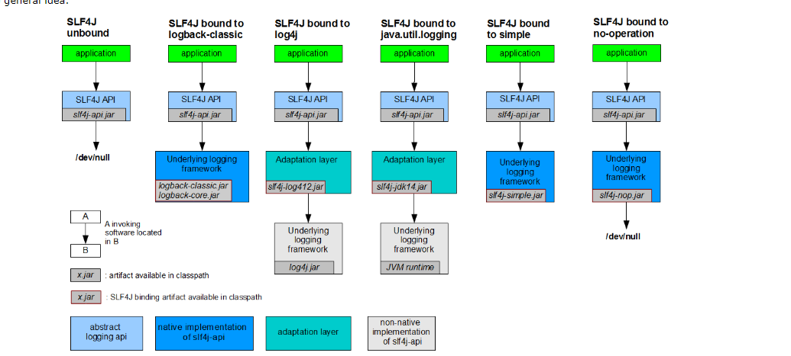

# SpringBoot学习笔记

[TOC]

------

# 一、 Spring Boot 入门

[Spring Boot 官方文档](https://spring.io/projects/spring-boot#learn)

## 预：必须掌握的技术：

- Spring 框架的使用经验
- 熟练使用Maven进行项目构建和依赖管理
- 熟练使用IDEA或Eclipse

## 1. Spring Boot 简介

### 背景

>    Spring Boot 来简化Spring 应用的开发，约定大于配置，去繁从简，明显提高开发效率

### 解决的问题

1. **Spring全家桶**时代
2. Spring Boot ——》J2EE一站式解决方案
3. Spring Cloud -> 分布式整体解决方案（Spring技术栈）

### 优点

- 快速创建独立运行的Spring项目以及与主流框架集成
- 使用嵌入式Servlet容器，应用无需打成WAR包，直接使用Java -jar jar包名即可运行
- starters自动依赖与版本控制
- 大量的自动配置，简化开发，也可以修改默认值
- 无需配置XML，无需代码生成，开箱即用
- 准生产环境的运行时应用监控
- 与云计算的天然集成

### 缺点

入门快，**精通很难**

>   Spring Boot是对Spring 框架的再封装，若对Spring不了解，对SpringBoot的封装机制也不会很了解，Spring Boot中许多自动配置，需要我们了解Spring的API（只有在了解Spring的API后才能更精通Spring Boot

## 2.微服务

martin fowler详细介绍了微服务[Martin Fowler:microservices](https://martinfowler.com/microservices/)

### What are Microservices?

微服务是一种架构风格

提倡在开发应用时，一个应用应该是一组小型服务；可以通过HTTP的方式进行互通

#### 单体应用

1. All In One ，
2. 是传统的架构，
3. 优点：开发 、部署、运维要简单，
4. 缺点：牵一发动全身，不适合大型应用
5. 在多个服务器上复制这个单体进行扩展

#### 微服务

1. 一个微服务架构把每个功能元素放进一个独立的服务中
2. 通过跨域服务器分发这些服务进行扩展，只在需要时进行扩展:runner:
3. 每一个功能元素都是一个可以替换和独立升级的软件单元
4. 详细参照微服务文档


## 3.环境准备

- Spring Boot推荐使用jdk的版本：1.7及以上
- maven:3.3及以上版本
- intellij idea
- Spring Boot

### Maven设置：

给maven的settings.xml配置文件的profiles标签添加

表明使用jdk1.8进行开发

```xml
<profile>
	<id>jdk-1.8</id>
	<activation>
	<activeByDefault>true/ activeByDefault>
	<jdk>1.8</jdk>
</activation>
	<properties>
		<maven. compiler .source>1。8</maven.compiler.source>
		<maven. compi ler. target>1.8</maven.compller.target>
		<maven. compiler. compilerverslon>1.8</maven.compiler.compllerversion>
	</propert1es>
</profile>
```

### Idea设置

进入设置页面 Ctrl+Alt+S

Build,Execution,Deployment-->Build Tools-->Maven 

设置maven为本地的maven， 库也为本地maven库

## 4.Spring Boot HelloWorld

完成一个功能：Hello，比较简单，不记了

## 5.Hello World 的探究

### 1)pom文件

#### a.父项目

```xml
<parent>
        <groupId>org.springframework.boot</groupId>
        <artifactId>spring-boot-starter-parent</artifactId>
        <version>2.2.0.RELEASE</version>
        <relativePath/> <!-- lookup parent from repository -->
    </parent>
```

他的父项目是

```xml
<parent>
    <groupId>org.springframework.boot</groupId>
    <artifactId>spring-boot-dependencies</artifactId>
    <version>2.2.0.RELEASE</version>
    <relativePath>../../spring-boot-dependencies</relativePath>
  </parent>
```

其中有各种依赖的版本，Spring Boot 通过此父项目真正管理Spring Boot里面的所有依赖版本（Spring Boot的依赖仲裁中心）

以后导入依赖不需要版本，（没有depenencies中依赖管理的需要自己声明版本号）

#### b.导入的依赖

```xml
<dependency>
            <groupId>org.springframework.boot</groupId>
            <artifactId>spring-boot-starter-web</artifactId>
        </dependency>
```

spring-boot-stater-**web** 

**spring-boot-stater:Spring Boot 场景启动器**：帮我们导入了web模块正常运行的组件

Spring Boot将所有的功能都抽取出来，做成一个个的staters(启动器)，只需要在项目中引入这些启动器，相关的依赖就能自动导入

### 2)主程序类，主入口类

```java
@SpringBootApplication
public class CaitApplication {

    public static void main(String[] args) {
        SpringApplication.run(CaitApplication.class, args);
    }

}
```

@SpringBootApplication 核心注解，标注在某个类上说明这个类是Spring Boot的主配置类，Spring Boot 一个运行这个类的main方法来启动应用：

```java
@Target({ElementType.TYPE})
@Retention(RetentionPolicy.RUNTIME)
@Documented
@Inherited
@SpringBootConfiguration
@EnableAutoConfiguration
@ComponentScan(
    excludeFilters = {@Filter(
    type = FilterType.CUSTOM,
    classes = {TypeExcludeFilter.class}
), @Filter(
    type = FilterType.CUSTOM,
    classes = {AutoConfigurationExcludeFilter.class}
)}
)
@ConfigurationPropertiesScan
public @interface SpringBootApplication {
```

- @**SpringBootConfiguration** Spring Boot 的配置类；

    - 标注在某个类上，表示这是一个Spring Boot 的配置类
    - @**Configuration** 配置类上来标注这个注解；（Spring4.X）
        - 配置类————配置文件；

- @**EnableAutoConfiguration** 开启自动配置功能；

    - 以前我们需要配置的东西，Spring Boot 帮我们自动配置；

    - @**EnableAutoConfiguration**告诉SpringBoot开启自动配置功能；这样自动配置才能生效

        - @**AutoConfigurationPackage** : 自动配置包
        - @**Import({AutoConfigurationImportSelector.class})**Spring的底层注解，给容器中导入一个组件；导入的组件有AutoConfigurationImportSelector.class

        更多知识在  **Spring注解版**

```java
@Target({ElementType.TYPE})
@Retention(RetentionPolicy.RUNTIME)
@Documented
@Inherited
@AutoConfigurationPackage
@Import({AutoConfigurationImportSelector.class})
public @interface EnableAutoConfiguration {
```

接下来从底层理解：

我们进入

```java
@Target({ElementType.TYPE})
@Retention(RetentionPolicy.RUNTIME)
@Documented
@Inherited
@Import({Registrar.class})
public @interface AutoConfigurationPackage {
}
```

@Import既然是SpringBoot 的底层注解，那Import的是什么？我们查看Registar的内容，发现这个是一个静态类

```java
static class Registrar implements ImportBeanDefinitionRegistrar, DeterminableImports {
        Registrar() {
        }

        public void registerBeanDefinitions(AnnotationMetadata metadata, BeanDefinitionRegistry registry) {
            AutoConfigurationPackages.register(registry, (new AutoConfigurationPackages.PackageImport(metadata)).getPackageName());
        }

        public Set<Object> determineImports(AnnotationMetadata metadata) {
            return Collections.singleton(new AutoConfigurationPackages.PackageImport(metadata));
        }
    }
```


其中，这个方法registerBeanDefinitions将bean注册到容器中，我们想知道注册的到底是什么，对这行代码进行调试，


点击运行Spring Boot，


通过调试信息我们知道，这个注解源头在CaitApplication(Spring Boot 启动类)

我们选择getPackName()方法，鼠标右键选择计算表达


**

结果证明：导入的包为com.cait.cait，也就是启动类所在的包中所有的bean。这表明，

**@AutoConfigurationPackage的实质是注册启动类所在包中所有标记的类为Bean**

<u>**（将主配置类所在包下以及所有子包中所有的组件扫描到Spring容器）**</u>


那么问题来了**EnableAutoConfiguration**中也有一个Import,这个Import又是什么作用

<u>**@Import()给容器中导入括号内组件**</u>

点进**AutoConfigurationImportSelector.class**

<u>*由于本人使用的Spring Boot 2.X，与1略有不同，下方为1的老师讲解*</u>

**EnableAutoConfigurationImportSelector**:导入哪些组件的选择器:car:

选择debug模式，查看


通过名字了解到是很多自动配置类(XXXAutoConfiguration)：就是给容器中导入这个场景需要的所有组件并配置好组件，使用不同的功能对应不同的配置文件

**<u>通过配置类，免去了我们手动编写配置注入功能组件的工作！！！</u>**

SpringFactoriesLoader.loadFactoryNames(EnableAutoConfiguration.class,classLoader);

<u>**Spring Boot 在启动的时候从类路径下META-INF/spring.factories中获取EnableAutoConfiguration指定的值，将这些值作为自动配置类导入到容器中，自动配置类就生效，帮我们进行自动配置工作**</u>以前我们需要自己配置的配置类，自动配置类都帮我们完成。J2EE的整体解决方案和自动配置都在spring-boot-autoconfigure-XXXX.jar中

## 6.使用Spring Initializer快速创建Spring Boot 项目

>   IDE都支持Spring Boot 的快速创建项目

### SpringBoot学习第一步：搭建基础
**<u>IDEA对SpringBoot的项目支持可以说是点击就能完成基础的搭建，方便的不得了，**</u>

### 流程如下
1.左上角File选项，New project，选择Spring Initializr


2.设置项目信息，Group 会自动创建Group文件夹，包含项目的代码；Artifact 的名字必须使用小写与下划线构成！！


3.选择web项目，右上角可以选择SpringBoot 的版本，一定要使用relese版本（正式版），不要使用SNAPSHOT版本


4.确定project的名字与位置，名字就是项目文件夹的名字


点击finish就好啦，一个SpringBoot+Maven项目就搞定了,最后创建三个基础包，上车愉快！


### 默认生成的Spring Boot 项目：

- 主程序已经生成，我们只需要我们自己的逻辑
- resouces文件夹中目录结构
    - static：保存所有的静态资源：js,css,images;
    - templates:保存所有的模板页面：（Spring Boot 默认jar包嵌入式的Tomcat，默认不支持Jsp页面）；可以使用模板引擎（freemarker、thymeleaf);
    - application.properties:Spring Boot 应用默认配置文件
    -  https://blog.csdn.net/weixin_44494373/article/details/102779187 

# 二、Spring Boot 配置

[CSDN博客](https://blog.csdn.net/weixin_44494373/article/details/102779187 )

## 1. 配置文件

Spring Boot 默认使用两种配置文件

-   application.properties
-   application.yml

>   配置文件的作用：修改Spring Boot自动配置的默认值；Spring Boot在底层自动配置好

YAML(YAML Ain't Markup Language )语言的文本，

-   YAML A Markup Language ：是一个标记语言
-   YAML isn't Markup Language ： 不是一个标记语言（XML类型标记文件）

标记语言：

-   以前的标记语言大多数使用的是 XXXX.xml
-   YAML ：以数据为中心，比json、xml等更适合做配置文件

## 2. YAML语法

### 1）基本语法

K:(空格)Value 表示一对键值对（空格必备）

以**<u>空格</u>**的缩进来控制层级关系；只要是左对齐的一列数据，都是同一个层级的 

```yaml
server:
	port: 8081
	path: /hello
```

属性与值也是大小写敏感的

### 2）值的写法

#### 字面量：普通的值（数字，字符串，布尔）

key: value (中间有空格)字面直接来写；

-   字符串默认不用加上单引号和双引号
    -   ""：双引号不会转义字符串里面的特殊字符；特殊字符会作为本身想表达的意思
        -   example: "zhangsan \n list"：输出：zhangshan (换行) list
    -   ''：单引号 会转义特殊字符，特殊字符最终只是一个普通的字符串数据
        -   example: "zhangsan \n list"：输出：zhangshan \n list

#### 对象、Map(属性和值)（键值对）

key: value

​	对象还是key: value的方式

example: create a object with propertities : lastName age

```yaml
friends:
	lastName: zhangshan
	age: 22
```

行内写法：用一行表示

```yaml
friends: {lastName: zhangshan , age: 18}
```

#### 数组（List、Set)：

用-值表示数组中的一个元素

```yaml
pets:
	-cat
	-dog
	-pig
```

行内写法

```yaml
pets: [cat,dog,pig]
```

## 附：Spring Boot单元测试

可以在测试期间很方便的类似编码一样进行自动注入容器的功能

```java
package com.cait.cait;

import org.junit.jupiter.api.Test;
import org.springframework.beans.factory.annotation.Autowired;
import org.springframework.boot.test.context.SpringBootTest;

@SpringBootTest
class CaitApplicationTests {

    @Autowired
    要进行测试的类
    @Test
    void contextLoads() {
        进行操作
    }

}


```

## 3. 通过配置文件注入

### 1) 数据绑定到基础数据类型

@**Value**

String LastName;

是Spring 底层的一个注解，

对应的xml

```xml
<bean class="person">
	<property name="LastName" value="字面量/${key}/#{SpEL}"></property>
</bean>
```

[^${key}]: 从环境变量、配置文件中获取值


### 2) 将数据绑定到类中 含配置文件与类绑定的方法

**<u>注： prefix必须全部为小写，配置的类名不能使用大写！！！！！，如 subMit是错误的！！</u>**

首先 类 与 配置文件要对应，在类前注释 @ConfigurationProperties(prefix="pets")

-   @ConfigurationProperties 告诉SpringBoot将本类中的所有属性和配置文件中相关属性进行绑定；

-   perfix="pets":配置文件中，该前缀下面的所有属性，进行一一映射

-   若报错，点击提示，官方说明应该添加依赖

-   ```xml
    <dependency>
        <groupId>org.springframework.boot</groupId>   
        <artifactId>spring-boot-configuration-processor</artifactId> 
        <optional>true</optional>
    </dependency>
    ```

-   只有这个组件是容器中的组件，才能使用容器提供的@ConfigurationProperties功能

-   添加@Component注解加入容器组件

总结：导入配置文件处理器，以后进行配置文件操作就有提示，类中<u>**属性的名要对应**</u>，类名可以不同，加入注解@ConfigurationProperties(prefix = "属性的前缀")

```xml
<dependency>
    <groupId>org.springframework.boot</groupId>   
    <artifactId>spring-boot-configuration-processor</artifactId> 
    <optional>true</optional>
</dependency>
```

**<u>配置文件少用中文！！！</u>**

若输出为乱码，原因是idea使用的是utf8

打开Setting，搜索file encoding(文件编码)，选择UTF8,同时选择需要在运行时转译为ascii

-   [x] Transparent native to ascii conversion

### 3) @Value 获取值和 @ConfigurationProperties获取值的比较

| 类型                 | @ConfigurationProperties | @Value                                     |
| -------------------- | ------------------------ | ------------------------------------------ |
| 功能                 | 批量注入配置文件中的属性 | 一个个指定                                 |
| 松散绑定（松散语法） | supported                | unsupported，要严格对应名                  |
| SpEL                 | unsupported              | supported                                  |
| JSR303               | supported                | unsupported                                |
| 复杂类型封装         | supported                | unsupported, only simple type is permitted |

[^松散绑定]: 驼峰式命名法与下划线命名法通用,即支持用特殊格式表示大写,example: fristName, frist_name, frist-name, frist_Name

配置文件yml于properties他们都能获取到值

-   <u>**如果说，我们只是在某个业务逻辑中需要获取一下文件中的某项值，使用@Value**</u>
-   <u>**如果单独写了一个JavaBean来匹配配置文件中的值，使用@ConfigurationProperties**</u>

### 4) 配置文件注入值数据校验

-   导入JSR303,在配置用的Bean上添加@Validated
-   Bean中属性上添加判断注解
-   @Email 就是邮箱校验
-   @NotNull是非空注解
-   [Spring boot @Validated注解以及配合@Valid的使用](https://blog.csdn.net/MR_L_0927/article/details/84784482)
-   [@Validated注解使用](https://blog.csdn.net/qq_19663899/article/details/79386043)

### 5） @PropertySource & @ImportResource

-   @PropertySource:加载指定的配置文件（非默认的application.yml）
-   参数Value指文件，**<u>encoding指编码，也很重要！！！</u>**

**<u>注：@PropertySource默认只能支持properties文件！！！！，</u>**

解决方案：[SpringBoot配置文件@PropertySource 同时支持properties文件与yaml(yml)](https://blog.csdn.net/liusf1993/article/details/87889868)

### 4）Spring配置文件注入

#### a.  @**ImportResource**: 导入Spring配置文件,让配置文件里面的内容生效；

想让Spring的配置文件生效，加载进来；将@ImportResouce标注在一个类上

```java
@ImportResource(locations= {"classpath:bean.xml"})
```


导入Spring配置文件：beans.xml并使其生效

#### b.  Spring Boot 推荐给容器添加组件的方式

-   配置类=======Spring 配置文件

-   使用@Bean添加

-   ```java
    package com.jirath.springboot_learn.config;
    
    import com.jirath.springboot_learn.service.HelloService;
    import org.springframework.context.annotation.Bean;
    import org.springframework.context.annotation.Configuration;
    
    /**
     * '@Configuratoin' point out that current object is a Configuration Class,which used to replace the Spring Configuration file before.
     */
    @Configuration
    public class MyConfig {
        /**
         * add current function's returned value to the ContextContainer,
         * the id of the module in this ContextContainer is the name of function;
         * @return the object which used to build a Bean
         */
        @Bean
        public HelloService helloService(){
            return new HelloService();
        }
    }
    
    ```

## 4.配置文件占位符

#### RandomValuePropertySource: 配置文件中可以使用随机数

${random.value}、${random.int}、${random.long}、${random.int(10)}、${random.int[1024,65536]}、${random.uuid}

#### 属性配置占位符

```properties
app.name=MyApp
app.description=${app.name} is a Spring Boot application
```

-   可以在配置文件中引用前面配置过的属性（优先级前面配置过的这里都能用）
-   ${app.name:defultValue}来指定找不到属性时的默认值
-   
-   若引用的值不存在，SpringBoot会默认将{}中间的值作为value
-   用${person.name:(defult)}可以设置默认为defult

## 5.Profile

在开发过程中会遇到**开发和实际生产时项目的配置是不同的情况**，应对这种情况，Spring设置了Profile，

<u>**Profile是Spring对不同环境提供不同配置功能的支持，可以通过激活、指定参数等方式快速切换环境**</u>

### 1）多Profile文件

我们在主配置文件编写的时候，文件名可以是 application-(profile).properties/yml

<u>**！！！注意，文件的profile必须在三个字符以内，否自无法作为配置文件！！**</u>

默认使用application.properties的配置：

### 2）yml支持多文档块方式

```yaml
spring:
	profiles:
		active: dev
---
server:
	port: 8081
spring:
	profiles: dev
	
---
server:
	port: 8081
spring:
	profiles: prod
```


### 3）激活指定Profile

-  ```properties
    spring.profiles.active=dev
    ```
    
-   命令行：

   -  --spring.profile.active=dev
   -  idea测试方法
   -  
   -  打包：
      -  打开maven选项，Lifecycle->package
      -  
   -  虚拟机方法：
       -  -Dspring-profiles.active=dev
       -  

## 6.配置文件的加载位置

spring boot 启动会扫描以下位置的application.properties / yml 文件作为Spring Boot的默认配置文件

-   file:./config
-   file:./
-   以上两种是在当前项目路径下，即与src同级
-   classpath:/config/
-   classpath:/
-   以上是按照优先级从高到低的顺序，所有位置的文件都会被加载，
-   <u>**高级优先配置内容会覆盖低级优先配置相同的内容，同时满足配置互补**</u>
-   我们也可以通过配置**spring.config.location**来改变<u>**默认配置**</u>
    -   项目打包好了以后，我们可以使用命令行参数的形式，启动项目的时候来指定配置文件的位置；**指定配置文件和默认加载的这些配置文件共同起作用，形成互补配置**
    -   
    -   即可以在外部改变配置

## 7.Spring Boot 外部配置加载顺序

Spring Boot也可以从以下位置加载配置；优先级从高到低

[Spring Boot官方文档](https://docs.spring.io/spring-boot/docs/2.2.2.BUILD-SNAPSHOT/reference/html/spring-boot-features.html#boot-features-external-config)

<u>优先加载带Profile，jar包外部的</u>

1.  命令行参数
2.  来自java:comp/env的NDI属性
3.  Java系统属性(System.getProperties())
4.  操作系统环境变量
5.  RandomValuePropertySource配置的random.*属性值
6.  jar包外部的application-{profile}.properties或application.yml(带spring.profile)配置文件
7.  jar包内部的application-{profile}.properties或application.yml(带spring.profile)配置文件
8.  jar包外部的application.properties或application.yml(不带spring.profile)配置文件
9.  jar包内部的application.properties或application.yml(不带spring.profile)配置文件
10.  @Configuration注解类上的@PropertySource
11.  通过SpringApplication.setDefaultProperties指定的默认属性

## 8.Spring Boot 自动配置原理

### 配置文件能写些什么？怎么写？自动配置的原理？

[Spring Boot官方文档关于配置文件](https://docs.spring.io/spring-boot/docs/2.2.2.BUILD-SNAPSHOT/reference/html/appendix-application-properties.html#common-application-properties)

### 自动配置原理：

1.  Spring Boot启动的时候，加载主配置类，开启了自动配置功能@EnableAutoConfiguration，

2.  @EnableAutoConfiguration的作用：

    -   利用EnableAutoConfigurationImportSelector给容器中导入一些组件

    -   可以查询selectImports()方法的内容；

    -   List<string>configurations=getCandidateConfigurations(annotation Metadata,attributes);获取候选的配置

        -   ```java
            protected List<String> getCandidateConfigurations(AnnotationMetadata metadata, AnnotationAttributes attributes) {
                    List<String> configurations = SpringFactoriesLoader.loadFactoryNames(this.getSpringFactoriesLoaderFactoryClass(), this.getBeanClassLoader());
                    Assert.notEmpty(configurations, "No auto configuration classes found in META-INF/spring.factories. If you are using a custom packaging, make sure that file is correct.");
                    return configurations;
                }
            ```

        -   ```java
            public final class SpringFactoriesLoader {
                public static final String FACTORIES_RESOURCE_LOCATION = "META-INF/spring.factories";
                private static final Log logger = LogFactory.getLog(SpringFactoriesLoader.class);
                private static final Map<ClassLoader, MultiValueMap<String, String>> cache = new ConcurrentReferenceHashMap();
            
                private SpringFactoriesLoader() {
                }
            ```

        -   扫描所有jar包类路径下 META-INF/spring.factories

        -   把扫描到的这些文件的内容包装成properties对象

        -   从properties中获取到EnableAutoCongratulation.class类（类名）对应的值，然后把他们添加在容器中

**<u>将类路径下 META-INF/spring.factories 里面配置的所有EnableAutoCongratulation的值加入到容器当中</u>**

位置：maven:spring-boot-autocongratulation->spring-boot-autoconfiguare-2X->META-INF->spring.factories

```properties
# Auto Configure
org.springframework.boot.autoconfigure.EnableAutoConfiguration=\
org.springframework.boot.autoconfigure.admin.SpringApplicationAdminJmxAutoConfiguration,\
org.springframework.boot.autoconfigure.aop.AopAutoConfiguration,\
org.springframework.boot.autoconfigure.amqp.RabbitAutoConfiguration,\
org.springframework.boot.autoconfigure.batch.BatchAutoConfiguration,\
org.springframework.boot.autoconfigure.cache.CacheAutoConfiguration,\
org.springframework.boot.autoconfigure.cassandra.CassandraAutoConfiguration,\
org.springframework.boot.autoconfigure.cloud.CloudServiceConnectorsAutoConfiguration,\
org.springframework.boot.autoconfigure.context.ConfigurationPropertiesAutoConfiguration,\
org.springframework.boot.autoconfigure.context.MessageSourceAutoConfiguration,\
org.springframework.boot.autoconfigure.context.PropertyPlaceholderAutoConfiguration,\
org.springframework.boot.autoconfigure.couchbase.CouchbaseAutoConfiguration,\
org.springframework.boot.autoconfigure.dao.PersistenceExceptionTranslationAutoConfiguration,\
org.springframework.boot.autoconfigure.data.cassandra.CassandraDataAutoConfiguration,\
org.springframework.boot.autoconfigure.data.cassandra.CassandraReactiveDataAutoConfiguration,\
org.springframework.boot.autoconfigure.data.cassandra.CassandraReactiveRepositoriesAutoConfiguration,\
org.springframework.boot.autoconfigure.data.cassandra.CassandraRepositoriesAutoConfiguration,\
org.springframework.boot.autoconfigure.data.couchbase.CouchbaseDataAutoConfiguration,\
org.springframework.boot.autoconfigure.data.couchbase.CouchbaseReactiveDataAutoConfiguration,\
org.springframework.boot.autoconfigure.data.couchbase.CouchbaseReactiveRepositoriesAutoConfiguration,\
org.springframework.boot.autoconfigure.data.couchbase.CouchbaseRepositoriesAutoConfiguration,\
org.springframework.boot.autoconfigure.data.elasticsearch.ElasticsearchAutoConfiguration,\
org.springframework.boot.autoconfigure.data.elasticsearch.ElasticsearchDataAutoConfiguration,\
org.springframework.boot.autoconfigure.data.elasticsearch.ElasticsearchRepositoriesAutoConfiguration,\
org.springframework.boot.autoconfigure.data.elasticsearch.ReactiveElasticsearchRepositoriesAutoConfiguration,\
org.springframework.boot.autoconfigure.data.elasticsearch.ReactiveRestClientAutoConfiguration,\
org.springframework.boot.autoconfigure.data.jdbc.JdbcRepositoriesAutoConfiguration,\
org.springframework.boot.autoconfigure.data.jpa.JpaRepositoriesAutoConfiguration,\
org.springframework.boot.autoconfigure.data.ldap.LdapRepositoriesAutoConfiguration,\
org.springframework.boot.autoconfigure.data.mongo.MongoDataAutoConfiguration,\
org.springframework.boot.autoconfigure.data.mongo.MongoReactiveDataAutoConfiguration,\
org.springframework.boot.autoconfigure.data.mongo.MongoReactiveRepositoriesAutoConfiguration,\
org.springframework.boot.autoconfigure.data.mongo.MongoRepositoriesAutoConfiguration,\
org.springframework.boot.autoconfigure.data.neo4j.Neo4jDataAutoConfiguration,\
org.springframework.boot.autoconfigure.data.neo4j.Neo4jRepositoriesAutoConfiguration,\
org.springframework.boot.autoconfigure.data.solr.SolrRepositoriesAutoConfiguration,\
org.springframework.boot.autoconfigure.data.redis.RedisAutoConfiguration,\
org.springframework.boot.autoconfigure.data.redis.RedisReactiveAutoConfiguration,\
org.springframework.boot.autoconfigure.data.redis.RedisRepositoriesAutoConfiguration,\
org.springframework.boot.autoconfigure.data.rest.RepositoryRestMvcAutoConfiguration,\
org.springframework.boot.autoconfigure.data.web.SpringDataWebAutoConfiguration,\
org.springframework.boot.autoconfigure.elasticsearch.jest.JestAutoConfiguration,\
org.springframework.boot.autoconfigure.elasticsearch.rest.RestClientAutoConfiguration,\
org.springframework.boot.autoconfigure.flyway.FlywayAutoConfiguration,\
org.springframework.boot.autoconfigure.freemarker.FreeMarkerAutoConfiguration,\
org.springframework.boot.autoconfigure.gson.GsonAutoConfiguration,\
org.springframework.boot.autoconfigure.h2.H2ConsoleAutoConfiguration,\
org.springframework.boot.autoconfigure.hateoas.HypermediaAutoConfiguration,\
org.springframework.boot.autoconfigure.hazelcast.HazelcastAutoConfiguration,\
org.springframework.boot.autoconfigure.hazelcast.HazelcastJpaDependencyAutoConfiguration,\
org.springframework.boot.autoconfigure.http.HttpMessageConvertersAutoConfiguration,\
org.springframework.boot.autoconfigure.http.codec.CodecsAutoConfiguration,\
org.springframework.boot.autoconfigure.influx.InfluxDbAutoConfiguration,\
org.springframework.boot.autoconfigure.info.ProjectInfoAutoConfiguration,\
org.springframework.boot.autoconfigure.integration.IntegrationAutoConfiguration,\
org.springframework.boot.autoconfigure.jackson.JacksonAutoConfiguration,\
org.springframework.boot.autoconfigure.jdbc.DataSourceAutoConfiguration,\
org.springframework.boot.autoconfigure.jdbc.JdbcTemplateAutoConfiguration,\
org.springframework.boot.autoconfigure.jdbc.JndiDataSourceAutoConfiguration,\
org.springframework.boot.autoconfigure.jdbc.XADataSourceAutoConfiguration,\
org.springframework.boot.autoconfigure.jdbc.DataSourceTransactionManagerAutoConfiguration,\
org.springframework.boot.autoconfigure.jms.JmsAutoConfiguration,\
org.springframework.boot.autoconfigure.jmx.JmxAutoConfiguration,\
org.springframework.boot.autoconfigure.jms.JndiConnectionFactoryAutoConfiguration,\
org.springframework.boot.autoconfigure.jms.activemq.ActiveMQAutoConfiguration,\
org.springframework.boot.autoconfigure.jms.artemis.ArtemisAutoConfiguration,\
org.springframework.boot.autoconfigure.groovy.template.GroovyTemplateAutoConfiguration,\
org.springframework.boot.autoconfigure.jersey.JerseyAutoConfiguration,\
org.springframework.boot.autoconfigure.jooq.JooqAutoConfiguration,\
org.springframework.boot.autoconfigure.jsonb.JsonbAutoConfiguration,\
org.springframework.boot.autoconfigure.kafka.KafkaAutoConfiguration,\
org.springframework.boot.autoconfigure.ldap.embedded.EmbeddedLdapAutoConfiguration,\
org.springframework.boot.autoconfigure.ldap.LdapAutoConfiguration,\
org.springframework.boot.autoconfigure.liquibase.LiquibaseAutoConfiguration,\
org.springframework.boot.autoconfigure.mail.MailSenderAutoConfiguration,\
org.springframework.boot.autoconfigure.mail.MailSenderValidatorAutoConfiguration,\
org.springframework.boot.autoconfigure.mongo.embedded.EmbeddedMongoAutoConfiguration,\
org.springframework.boot.autoconfigure.mongo.MongoAutoConfiguration,\
org.springframework.boot.autoconfigure.mongo.MongoReactiveAutoConfiguration,\
org.springframework.boot.autoconfigure.mustache.MustacheAutoConfiguration,\
org.springframework.boot.autoconfigure.orm.jpa.HibernateJpaAutoConfiguration,\
org.springframework.boot.autoconfigure.quartz.QuartzAutoConfiguration,\
org.springframework.boot.autoconfigure.rsocket.RSocketMessagingAutoConfiguration,\
org.springframework.boot.autoconfigure.rsocket.RSocketRequesterAutoConfiguration,\
org.springframework.boot.autoconfigure.rsocket.RSocketServerAutoConfiguration,\
org.springframework.boot.autoconfigure.rsocket.RSocketStrategiesAutoConfiguration,\
org.springframework.boot.autoconfigure.security.servlet.SecurityAutoConfiguration,\
org.springframework.boot.autoconfigure.security.servlet.UserDetailsServiceAutoConfiguration,\
org.springframework.boot.autoconfigure.security.servlet.SecurityFilterAutoConfiguration,\
org.springframework.boot.autoconfigure.security.reactive.ReactiveSecurityAutoConfiguration,\
org.springframework.boot.autoconfigure.security.reactive.ReactiveUserDetailsServiceAutoConfiguration,\
org.springframework.boot.autoconfigure.security.rsocket.RSocketSecurityAutoConfiguration,\
org.springframework.boot.autoconfigure.security.saml2.Saml2RelyingPartyAutoConfiguration,\
org.springframework.boot.autoconfigure.sendgrid.SendGridAutoConfiguration,\
org.springframework.boot.autoconfigure.session.SessionAutoConfiguration,\
org.springframework.boot.autoconfigure.security.oauth2.client.servlet.OAuth2ClientAutoConfiguration,\
org.springframework.boot.autoconfigure.security.oauth2.client.reactive.ReactiveOAuth2ClientAutoConfiguration,\
org.springframework.boot.autoconfigure.security.oauth2.resource.servlet.OAuth2ResourceServerAutoConfiguration,\
org.springframework.boot.autoconfigure.security.oauth2.resource.reactive.ReactiveOAuth2ResourceServerAutoConfiguration,\
org.springframework.boot.autoconfigure.solr.SolrAutoConfiguration,\
org.springframework.boot.autoconfigure.task.TaskExecutionAutoConfiguration,\
org.springframework.boot.autoconfigure.task.TaskSchedulingAutoConfiguration,\
org.springframework.boot.autoconfigure.thymeleaf.ThymeleafAutoConfiguration,\
org.springframework.boot.autoconfigure.transaction.TransactionAutoConfiguration,\
org.springframework.boot.autoconfigure.transaction.jta.JtaAutoConfiguration,\
org.springframework.boot.autoconfigure.validation.ValidationAutoConfiguration,\
org.springframework.boot.autoconfigure.web.client.RestTemplateAutoConfiguration,\
org.springframework.boot.autoconfigure.web.embedded.EmbeddedWebServerFactoryCustomizerAutoConfiguration,\
org.springframework.boot.autoconfigure.web.reactive.HttpHandlerAutoConfiguration,\
org.springframework.boot.autoconfigure.web.reactive.ReactiveWebServerFactoryAutoConfiguration,\
org.springframework.boot.autoconfigure.web.reactive.WebFluxAutoConfiguration,\
org.springframework.boot.autoconfigure.web.reactive.error.ErrorWebFluxAutoConfiguration,\
org.springframework.boot.autoconfigure.web.reactive.function.client.ClientHttpConnectorAutoConfiguration,\
org.springframework.boot.autoconfigure.web.reactive.function.client.WebClientAutoConfiguration,\
org.springframework.boot.autoconfigure.web.servlet.DispatcherServletAutoConfiguration,\
org.springframework.boot.autoconfigure.web.servlet.ServletWebServerFactoryAutoConfiguration,\
org.springframework.boot.autoconfigure.web.servlet.error.ErrorMvcAutoConfiguration,\
org.springframework.boot.autoconfigure.web.servlet.HttpEncodingAutoConfiguration,\
org.springframework.boot.autoconfigure.web.servlet.MultipartAutoConfiguration,\
org.springframework.boot.autoconfigure.web.servlet.WebMvcAutoConfiguration,\
org.springframework.boot.autoconfigure.websocket.reactive.WebSocketReactiveAutoConfiguration,\
org.springframework.boot.autoconfigure.websocket.servlet.WebSocketServletAutoConfiguration,\
org.springframework.boot.autoconfigure.websocket.servlet.WebSocketMessagingAutoConfiguration,\
org.springframework.boot.autoconfigure.webservices.WebServicesAutoConfiguration,\
org.springframework.boot.autoconfigure.webservices.client.WebServiceTemplateAutoConfiguration

```


-   每一个这样的XXXAutoConfrigulation类都是容器的一个组件，都加入到容器中；用他们来做自动配置；

-   每一个自动配置类进行自动配置功能；

-   以**HttpEncodingAutoConfiguration（Http编码自动配置）**为例解释自动配置原理；

-   ```java
    @Configuration(
        proxyBeanMethods = false
    )//表示这是一个配置类，与之前编写配置文件一样，也可以给容器中添加组件
    @EnableConfigurationProperties({HttpProperties.class})//启用ConfigurationProperties功能:将配置文件中对应的值和HttpEncodingProperties绑定起来;并把 HttpProperties 加入到Spring的ioc容器中来
    @ConditionalOnWebApplication(
        type = Type.SERVLET
    )//考虑webapp，Spring底层@Conditional注解，根据不同的条件，如果满足指定的条件，整个配置类就会生效;   判断当前应用是否是web应用，如果是，当前配置类才生效
    @ConditionalOnClass({CharacterEncodingFilter.class})//判断当前项目有没有这个类 CharacterEncodingFilter ：SpringMVC进行乱码解决的过滤器
    @ConditionalOnProperty(
        prefix = "spring.http.encoding",
        value = {"enabled"},
        matchIfMissing = true
    )//判断配置文件中是否存在某个配置spring.http.encoding.enabled ; 如果不存在判断也是成立的，即使配置文件中不配值，也是默认生效的；
    public class HttpEncodingAutoConfiguration {
        /**
     *他已经和SpringBoot的配置文件映射了
         *
         **/
        private final Encoding properties;
    
        //只有一个有参构造器的情况下，参数的值就会从容器中拿
        public HttpEncodingAutoConfiguration(HttpProperties properties) {
            this.properties = properties.getEncoding();
        }
    
        @Bean//给容器中添加组件，这个组件的某些值需要从properties中获取
        @ConditionalOnMissingBean
        public CharacterEncodingFilter characterEncodingFilter() {
            CharacterEncodingFilter filter = new OrderedCharacterEncodingFilter();
            filter.setEncoding(this.properties.getCharset().name());//获取编码
            filter.setForceRequestEncoding(this.properties.shouldForce(org.springframework.boot.autoconfigure.http.HttpProperties.Encoding.Type.REQUEST));
            filter.setForceResponseEncoding(this.properties.shouldForce(org.springframework.boot.autoconfigure.http.HttpProperties.Encoding.Type.RESPONSE));
            return filter;
        }
    }
    ```
    
    -   根据当前不同条件判断，决定这个配置类是否生效？
    -   SpringBoot1.X中属性在HttpEncodingProperties中可以查看，2.X中无注释
    -   一旦这个配置类生效；这个配置就会给容器中添加各种组件；这些组件的属性是从对应的properties中获取的，这些类中的每一个属性又是和配置文件绑定的
    
-   所有配置文件中能配置的属性都是在xxxxProperties类中封装着

-    ```java
    //
    // Source code recreated from a .class file by IntelliJ IDEA
    // (powered by Fernflower decompiler)
    //
    
    package org.springframework.boot.autoconfigure.http;
    
    import java.nio.charset.Charset;
    import java.nio.charset.StandardCharsets;
    import java.util.Locale;
    import java.util.Map;
    import org.springframework.boot.context.properties.ConfigurationProperties;
    
    @ConfigurationProperties(
        prefix = "spring.http"
    )//从配置文件中获取指定的值和bean的属性进行绑定
    public class HttpProperties {
        private boolean logRequestDetails;
        private final HttpProperties.Encoding encoding = new HttpProperties.Encoding();
    
       //...................
    }
    
    ```

-   ```properties
    #我们能配置的属性都来源于这个功能的properties类
    spring.http.encoding.enabled=true
    #字符集
    spring.http.encoding.charset=utf-8
    #强制编码 请求响应必须为UTF8
    spring.http.encoding.force=true
    ```

### 精髓

1.  **SpringBoot启动会加载大量自动配置类**
2.  **我们看我们需要的功能有没有SpringBoot默认写好的自动配置类；**
3.  **我们再来看这个自动配置类中到底配置了哪些组件；**
    -   **只要我们要用的组件存在，我们就不需要配置**
4.  **给容器中自动配置类添加组件的时候，会从properties类中获取某些属性，我们就可以在配置文件中指定这些属性的值**

xxxxxAutoConfiguration:自动配置类；

给容器中添加组件

xxxxproperties:封装配置文件中相关属性；

for example:

1.  全局搜索相关自动配置类
2.  点击查看XXXXProperties，类中属性即为可以配置的属性

## 3.自动配置原理（细节）

### 1）@Conditional派生注解（Spring注解版原生的@Conditional作用）

作用：必须是@Conditional指定的条件成立，才给容器中添加组件，配置配里面的内容才生效

 

| **@Conitional扩展注解**         | **作用（判断是否满足当前指定条件）**             |
| :------------------------------ | ------------------------------------------------ |
| @ConditionalOnJava              | 系统的Java版本是否符合要求                       |
| @ConditionalOnBean              | 容器中存在指定Bean                               |
| @ConditionalOnMissingBean       | 容器中不存在指定Bean                             |
| @ConditionalOnExpression        | 满足SpEl表达式指定                               |
| @ConditionalOnClass             | 系统中有指定的类                                 |
| @ConditionalOnMissingClass      | 系统中没有指定的类                               |
| @ConditionalOnSingleCandidate   | 容器中只有一个指定的Bean，或者这个Bean是首选Bean |
| @ConditionalOnProperty          | 系统中指定的属性是否有指定的值                   |
| @ConditionalOnResource          | 类路径下是否存在指定资源文件                     |
| @ConditionalOnWebApplication    | 当前是web环境                                    |
| @ConditionalOnNotWebApplication | 当前不是web环境                                  |
| @ConditionalOnJndi              | JNDI存在指定项                                   |

自动配置类必须在一定条件下生效:hot_pepper:

我们怎么知道那些自动配置类生效？

在配置文件中编写

```properties
#开启SpringBoot的debug
debug=true
```

我们可以通过启用debug=true属性；来让控制台打印自动生成报告，这样我们就可以很方便的知道哪些自动配置类生效

Positive matches: 自动配置类启用的

Negative matches: 未匹配到


# 三、Spring Boot 与日志

## 1、日志框架

小张在开发一个大型系统；

1.  System.out.println("");将关键信息打印在控制台；老板希望去掉；又想要用
2.  做成一个框架记录系统运行时的信息；
3.  高大上的几个功能：
    -   异步模式
    -   自动归档
    -   XXXX
4.  卸载老框架，换新框架，重新修改相关API;（很麻烦）
5.  JDBC---数据库驱动启发；
    -   写了一个接口层：日志门面（日志的一个抽象层）；logging-abstract.jar
    -   给项目中导入具体的日志实现就行了；我们之前的日志框架都是实现的抽象层

市面上的日志框架

JUL , JCL , Jboss-logging , logback , log4j , log4j2 , slf4j

| 日志门面（日志抽象层）                                       | 日志实现                                       |
| ------------------------------------------------------------ | ---------------------------------------------- |
| ~~JCL(Jakarta Commons Logging)~~、SLF4j(Simple Logging Facae For Java)、~~Jboss-logging~~ | log4j、JUL(java.util.logging)、log4j2、logback |

左边选一个门面（抽象层）、右边来选一个实现

-   Jboss 太复杂 JCL 最后一次更新在2014年 
-   SLF4j log4j logback出自同一人
-   Log4j2 Apache公司的全新日志框架

日志门面：SLF4J;

日志实现：Logback > log4j

SpringBoot ：底层是Spring框架，Spring框架默认使用是JCL

**SpringBoot 选用SLF4j和logback**

## 2、SLF4j使用

[SLF4j官网](http://slf4j.org/)

### 1）如何在系统中使用SLF4j

以后在开发的时候，日志记录方法的调用，不应该来直接调用日志的实现类，二傻调用日志抽象层里面的方法；

给系统里面导入slf4j的jar和logback的实现jar

```java
import org.slf4j.Logger;
import org.slf4j.LoggerFactory;

public class HelloWorld {
  public static void main(String[] args) {
    Logger logger = LoggerFactory.getLogger(HelloWorld.class);
    logger.info("Hello World");
  }
}
```

slf4j使用的情况



SELF4j关联了logback日志框架后的正确使用情况


调用SELF4j的接口，SELF4j调用底层日志的jar包

使用log4j时，系统会使用适配层

通过适配层将两者关联

### 2）遗留问题

for example:a情况（slf4j+logback):Spring (commons-logging)、Hibernate( jBOSS-logging)、Mybatis...

统一日志记录，即使 是别的框架，和我一起统一使用slf4j进行输出

[介绍](http://slf4j.org/legacy.html)


1.  <u>**将系统中其他日志框架先排出去**</u>
2.  <u>**用中间包替换所有的日志框架**</u>
3.  <u>**导入slf4j其他的实现**</u>

​                   ----------------------SpringBoot就是这么实现的

### 3）SpringBoot日志关系

使用idea创建，选择web，默认携带self4j+logback

在pom文件中，选择导入的依赖，右键，选择Diagrams->Show Dependencies,idea就可以用树状图的方式展现依赖之间的关系，按住alt即可放大镜查看


```xml
<dependency>
      <groupId>org.springframework.boot</groupId>
      <artifactId>spring-boot-starter</artifactId>
    </dependency>
```

SpringBoot 使用他来做日志功能

```xml
<dependency>
      <groupId>org.springframework.boot</groupId>
      <artifactId>spring-boot-starter-logging</artifactId>
      <version>2.2.0.RELEASE</version>
      <scope>compile</scope>
    </dependency>
```


总结：

1.  使用logback记录日志
2.  把其他日志转为slf4j
3.  导入抽象层
4.  中间替换包（偷梁换柱）
5.  如果我们要引入其他框架，一定要把这个框架的默认日志依赖移除
    1.  新版本的Spring不再使用commons-logging,所以新的Spring Boot中没有去除该框架

**<u>SpringBoot能自动适配所有的日志，而且底层使用的是slf4j+logback的方式记录日志，引入其他框架的时候，只需要把这个框架依赖的日志框架排除掉</u>**

## 3.日志使用

### 1）默认配置

SpringBoot 默认帮我们配置好了日志；

```java
 //记录器
    org.slf4j.Logger logger= org.slf4j.LoggerFactory.getLogger(getClass());

    @Test
    void contextLoads() {
        //日志的级别
        //由低到高 trace debug info warn error
        //可以调整需要输出的日志级别，日志就只会在这个级别的更高级别生效
        logger.trace("这是trance日志");
        logger.debug("这是debug日志");
        //SpringBoot 默认使用的是info级别,没有指定级别的就用SpringBoot默认规定的级别：root级别(info)
        logger.info("这是info日志");
        logger.warn("这是warn日志");
        logger.error("这是error日志");
    }

```

SpringBoot修改日志默认配置

path和file都存在，file为主

```properties
logging.level.com.jirath=trace
#在当前磁盘下新建Spring和log文件夹：使用spring.log作为默认文件
logging.file.path=/spring/log
#不指定路径就在当前项目下生成日志
#logging.file.name=springboot.log
#可以指定完整路径
logging.file.name=E:/springboot.log
#在控制台输出的日志格式
logging.pattern.console================%n%d{yyyy-MM-dd} [%thread] %-5level %logger{50} - %msg%n
#指定文件中日志输出格式
logging.pattern.file=
```


SpringBoot 关于日志的其他默认设置在哪里？

位于

spring-boot-2.2.0.RELEASE.jar!/org/springframework/boot/logging/logback/中

打开即为SpringBoot针对LogBack的配置封装。

for example:

其中，SpringBoot将默认级别(root)设置为了info

在配置文件中配置的属性会被一个名为<u>LoggingApplicationListener</u>（单击配置文件配置项即可查看）相似的类接收

<u>LoggingApplicationListener</u>同时与一个<u>LoggingSystemProperties</u>（在logback桶目录下）的类对应在这里获取输入的值，进行解析 

在base.xml中SpringBoot针对控制台与文件输出有分别的定义，如图


在文件默认配置中，SpringBoot同时设置了文件在最大数值，当超出数值，日志就会自动分文件记录，如：log1,log2

### 2）指定配置

在实际使用时，同时会遇到其他功能的需求，自动归档等等等等，

要想使用自己的配置文件，Spring.io中在特性下有一章节专门讲述了SpringBoot配置默认日志的方法：在Spring目录中放logback.xml即可

给类路径下放上每个框架自己的配置文件即可：SpringBoot就不再使用默认配置

 Spring Boot includes a number of extensions to Logback that can help with advanced configuration. You can use these extensions in your `logback-spring.xml` configuration file. 

logback.xml:直接被日志框架识别

logback-spring.xml：日志就不直接加载日志配置项，由SpringBoot解析日志配置，就可以使用SpringBoot的高级Profile功能

```xml
<springProfile name="dev">
	<!--可以指定某段配置只在某个环境下生效-->
</springProfile>
```

### 3）切换日志框架

例子：使用log4j

1.  打开依赖关系图，选择logback,exclude,将logback排除
2.  去除log4j-over-slf4j(将log4j替换为slf4j的包)
3.  导入slf4j-log4j12(无需写版本)，会自动的导入log4j
4.  运行

但是，<u>**此行为无意义**</u>，log4j因为表现不理想，原作开发了logback;

使用其他日志框架：

1.  排除stater-logging
2.  引入stater-log4j2

# 四、SpringBoot与Web开发

>   Thymeleaf、web定制、容器定制

## 1、使用SpringBoot

1.  **创建SpringBoot应用，选中我们需要的模块；**
2.  **SpringBoot已经默认将这些场景布置好，只需要在配置文件中指定少量配置就可以运行起来；**
3.  **自己编写业务代码；**

**自动配置原理**？

这个场景SpringBoot帮我们配置了什么？能不能修改？能不能扩展？......

1.  XXXXAutoConfiguration:帮我们给容器中自动配置组件
2.  在Spring-boot-autoconfigure中找到web模块
3.  自动配置类在其中
4.  XXXProperties：配置类来封装配置文件的内容

## 2、SpringBoot对静态页面的映射规则

在WebMvcAutoConfiguration中

### 访问静态资源

#### 第一种 导入的webjars

````java
public void addResourceHandlers(ResourceHandlerRegistry registry) {
            if (!this.resourceProperties.isAddMappings()) {
                logger.debug("Default resource handling disabled");
            } else {
                Duration cachePeriod = this.resourceProperties.getCache().getPeriod();
                CacheControl cacheControl = this.resourceProperties.getCache().getCachecontrol().toHttpCacheControl();
                if (!registry.hasMappingForPattern("/webjars/**")) {
                    this.customizeResourceHandlerRegistration(registry.addResourceHandler(new String[]{"/webjars/**"}).addResourceLocations(new String[]{"classpath:/META-INF/resources/webjars/"}).setCachePeriod(this.getSeconds(cachePeriod)).setCacheControl(cacheControl));
                }

                String staticPathPattern = this.mvcProperties.getStaticPathPattern();
                if (!registry.hasMappingForPattern(staticPathPattern)) {
                    this.customizeResourceHandlerRegistration(registry.addResourceHandler(new String[]{staticPathPattern}).addResourceLocations(WebMvcAutoConfiguration.getResourceLocations(this.resourceProperties.getStaticLocations())).setCachePeriod(this.getSeconds(cachePeriod)).setCacheControl(cacheControl));
                }

            }
        }

````

1.  由上方代码，所有/webjars/**,下的请求都会去classpath:/META-INF/resources/webjars/中寻找资源

    -   webjars：以jar包的方式引入静态资源；
    -   [webJars](https://www.webjars.org/)
    -   将常用的前端框架给了一个Maven依赖的方式
    -   选好要使用的版本，在pom文件中引入即可
    -   引入后在jar包中，设置中显示隐藏文件夹即可打开，符合映射规则

2.  代码中同时设置了缓存时间，缓存时间可以在resourceProperties中设置

    -   ````java
        Duration cachePeriod = this.resourceProperties.getCache().getPeriod();
        ````

    -   ````java
        @ConfigurationProperties(
            prefix = "spring.resources",
            ignoreUnknownFields = false
        )
        public class ResourceProperties {
        //可以设置与静态资源有关的参数，缓存时间
        ````

#### 第二种"/**"访问当前项目的任何资源


第二种规则："/**"访问当前项目的任何资源，

````java
 String staticPathPattern = this.mvcProperties.getStaticPathPattern();
                if (!registry.hasMappingForPattern(staticPathPattern)) {
                    this.customizeResourceHandlerRegistration(registry.addResourceHandler(new String[]{staticPathPattern}).addResourceLocations(WebMvcAutoConfiguration.getResourceLocations(this.resourceProperties.getStaticLocations())).setCachePeriod(this.getSeconds(cachePeriod)).setCacheControl(cacheControl));
                }
````

进入getResoutceLocations

````java
static String[] getResourceLocations(String[] staticLocations) {
        String[] locations = new String[staticLocations.length + SERVLET_LOCATIONS.length];
        System.arraycopy(staticLocations, 0, locations, 0, staticLocations.length);
        System.arraycopy(SERVLET_LOCATIONS, 0, locations, staticLocations.length, SERVLET_LOCATIONS.length);
        return locations;
    }
````

查看代码是从其他方法中引入了参数（与1版本不同）

返回查看参数的来源

```java
getStaticLocations
```


````java
private static final String[] CLASSPATH_RESOURCE_LOCATIONS = new String[]{"classpath:/META-INF/resources/", "classpath:/resources/", "classpath:/static/", "classpath:/public/"};

````

得总结

"/**"访问当前项目的任何资源（静态资源文件夹）都会在下方的文件夹中找内容

-   "classpath:/META-INF/resources/",
-   "classpath:/resources/"，非默认的<u>**resources**</u>,而是新建的resources文件夹
-    "classpath:/static/"
-    "classpath:/public/",(默认无，需要新建)
-   "/":当前项目的路径

### 欢迎页配置

````java
@Bean
        public WelcomePageHandlerMapping welcomePageHandlerMapping(ApplicationContext applicationContext, FormattingConversionService mvcConversionService, ResourceUrlProvider mvcResourceUrlProvider) {
            WelcomePageHandlerMapping welcomePageHandlerMapping = new WelcomePageHandlerMapping(new TemplateAvailabilityProviders(applicationContext), applicationContext, this.getWelcomePage(), this.mvcProperties.getStaticPathPattern());
            welcomePageHandlerMapping.setInterceptors(this.getInterceptors(mvcConversionService, mvcResourceUrlProvider));
            return welcomePageHandlerMapping;
        }
````

````java
private Optional<Resource> getWelcomePage() {
            String[] locations = WebMvcAutoConfiguration.getResourceLocations(this.resourceProperties.getStaticLocations());
            return Arrays.stream(locations).map(this::getIndexHtml).filter(this::isReadable).findFirst();
        }
private Resource getIndexHtml(String location) {
            return this.resourceLoader.getResource(location + "index.html");
        }
````

静态资源文件夹下所有index.html页面：被"/**"映射

### 图标

所有的**/favicon.ico都是在静态资源环境下找；

同时静态资源的位置是可以改变的

spring.resources.static-location=位置

### 3、模板引擎

>   之前多使用jsp页面，可以很方便的嵌入数据等，但SpringBoot 使用嵌入式的tomcat,不支持jsp页面，只能支持HTML,

JSP、Velocity、Freemarker、Thymeleaf；

模板引擎的作用：在写页面时，将一些数据与渲染数据的模板结合输出，JSP与其他的模板引擎都是这一原理

SpringBoot推荐的Thymeleaf；

语法更简单，功能更强大；

#### 引入thymeleaf

    -   ````xml
        <dependency>
                    <groupId>org.springframework.boot</groupId>
                    <artifactId>spring-boot-starter-thymeleaf</artifactId>
                </dependency>
        ````
    
    -   详情见SpringBoot官网文档
    
    -   布局功能的支持程序 thymeleaf3主程序 layout2以上版本

#### Thymeleaf使用&语法

    -   在AutoConf...中有配置类，打开properties有默认自动配置项
    
    -   ````java
            private static final Charset DEFAULT_ENCODING;
            public static final String DEFAULT_PREFIX = "classpath:/templates/";
            public static final String DEFAULT_SUFFIX = ".html";
            private boolean checkTemplate = true;
            private boolean checkTemplateLocation = true;
            private String prefix = "classpath:/templates/";
            private String suffix = ".html";
            private String mode = "HTML";
            private Charset encoding;
            private boolean cache;
            private Integer templateResolverOrder;
            private String[] viewNames;
            private String[] excludedViewNames;
            private boolean enableSpringElCompiler;
            private boolean renderHiddenMarkersBeforeCheckboxes;
            private boolean enabled;
            private final ThymeleafProperties.Servlet servlet;
            private final ThymeleafProperties.Reactive reactive;
        //只要我们把HTML文件放在classpath:/templates/，thymeleaf就能自动渲染
        //同时可以在配置文件中修改配置
        ````
    
    -   [thymeleaf官网](https://www.thymeleaf.org/)
    
    -   
    
    -   现代化java服务端的模板引擎
    
    -   
    
    -   使用
    
    ````ht
    导入开启thymeleaf的语法空间，开启语法提示
    <html lang="en"  xmlns:th="http://www.thymeleaf.org">
    ````
    
    ````java 
    @RequestMapping("/html")
        public String testHtml(Map<String,Object> map){
            map.put("hello", "这是Controller中返回的话");
            return "testPage";
        }
    ````


​    

    ````html
    <!DOCTYPE html>
    <html lang="en"  xmlns:th="http://www.thymeleaf.org">
    <head>
        <meta charset="UTF-8">
        <title>test</title>
    </head>
    <body>
    <h1>这是一个测试文字</h1>
    <!--将div里面的文本内容设置为,可以替换静态的信息-->
    <div th:text="${hello}">这是静态的语句</div>
    </body>
    </html>
    ````

#### 语法规则

详见官方文档：Attribute Precedence

使用${AttributeName}取值

##### 1)、th:text 改变当前元素里面的内容

th:任意html属性 替换原生属性的值


##### 2）表达式

详见thymeleaf文档 expression

<u>Simple expressions:(表达式语法)</u>

######     Variable Expressions: ${...} 获取变量值，OGNL;

1.  获取对象的属性、调用方法
    1.  使用内置的基本对象
        1.  #ctx : the context object.
        2.  #vars: the context variables.
        3.   #locale : the context locale.
        4.  #request : (only in Web Contexts) the HttpServletRequest object.
        5.   #response : (only in Web Contexts) the HttpServletResponse object. 
        6.  #session : (only in Web Contexts) the HttpSession object. 
        7.   #servletContext : (only in Web Contexts) the ServletContext object.例子：附录中更详细
        8.  `Established locale country: <span th:text="${#locale.country}">US</span>.`
    2.  内置的一些工具对象
                            #execInfo : information about the template being processed. 
                            #messages : methods for obtaining externalized messages inside variables expressions, in the same way as they would be obtained using #{…} syntax.
                            #uris : methods for escaping parts of URLs/URIs
                            #conversions : methods for executing the configured conversion service (if any). 
                            #dates : methods for java.util.Date objects: formatting, component extraction, etc. 
                            #calendars : analogous to 
                            #dates , but for java.util.Calendar objects. #numbers : methods for formatting numeric objects.
                            #strings : methods for String objects: contains, startsWith, prepending/appending, etc.
                            #objects : methods for objects in general.
                            #bools : methods for boolean evaluation.
                            #arrays : methods for arrays. 
                            #lists : methods for lists. #sets : methods for sets. 			  #maps : methods for maps. 
                            #aggregates : methods for creating aggregates on arrays or collections. 
                            #ids : methods for dealing with id attributes that might be repeated (for example, as a result of an iteration).
                			用法详见附录中的示例
                    Selection Variable Expressions: *{...} 变量的选择表达式，与${}在性质上是一样的，补充：配合th:object 使用
       3.  例子：附录中更详细

######     Message Expressions: #{...} 获取国际化内容

######     Link URL Expressions: @{...} 定义URL链接

######     Fragment Expressions: ~{...}  插入文档

###### Literals（字面量）

1.  Text literals: 'one text' , 'Another one!' ,…
2.  Number literals: 0 , 34 , 3.0 , 12.3 ,… 
3.  Boolean literals: true , false 
4.  Null literal: null 
5.  Literal tokens: one , sometext , main ,…

###### Text operations: （文本操作）

1.  String concatenation: +
2.  Literal substitutions: |The name is ${name}|

###### Arithmetic operations: (数学运算)

1.  Binary operators: + , - , * , / , % 
2.  Minus sign (unary operator): 

###### Boolean operations: (布尔运算)

1.  Binary operators: and , or 
2.  Boolean negation (unary operator): ! , not

###### Comparisons and equality:(比较运算)

1.  Comparators: > , < , >= , <= ( gt , lt , ge , le ) 
2.  Equality operators: == , != ( eq , ne )

###### Conditional operators:(条件运算)（三元运算符也支持）

1.  If-then: (if) ? (then)
2.  If-then-else: (if) ? (then) : (else) 
3.  Default: (value) ?: (defaultvalue)

###### Special tokens:(特殊)

1.  No-Operation: _     <u>**不做处理**</u>

````java
OGNL的例子
/* * Access to properties using the point (.). Equivalent to calling property getters. */ 
${person.father.name}
/* * Access to properties can also be made by using brackets ([]) and writing  * the name of the property as a variable or between single quotes. */ 
${person['father']['name']}
/* * If the object is a map, both dot and bracket syntax will be equivalent to  * executing a call on its get(...) method. */ ${countriesByCode.ES} ${personsByName['Stephen Zucchini'].age}
/* * Indexed access to arrays or collections is also performed with brackets,  * writing the index without quotes. */ ${personsArray[0].name}
/* * Methods can be called, even with arguments. */ ${person.createCompleteName()} ${person.createCompleteNameWithSeparator('-')}

````

## 4、SpringMVC自动配置

[SpringBoot官方文档对SpringMVC的介绍](https://docs.spring.io/spring-boot/docs/2.2.2.BUILD-SNAPSHOT/reference/html/spring-boot-features.html#boot-features-developing-web-applications)

#### 7.1.1. Spring MVC Auto-configuration

Spring Boot provides auto-configuration for Spring MVC that works well with most applications.

The auto-configuration adds the following features on top of Spring’s defaults:

以下是SpringBoot 对SpringMVC的默认配置：

-   Inclusion of `ContentNegotiatingViewResolver` and `BeanNameViewResolver` beans.
    -   自动配置ViewResolver(视图解析器:根据方法的返回值得到视图对象(View),视图对象决定如何渲染（转发？重定向？）)
    -   如何定制：我们可以自己给容器中添加一个视图解析器；自动的将其整合进来；
    
-   Support for serving static resources, including support for WebJars (covered [later in this document](https://docs.spring.io/spring-boot/docs/2.2.2.BUILD-SNAPSHOT/reference/html/spring-boot-features.html#boot-features-spring-mvc-static-content))). <u>静态资源文件夹路径和webjars</u>

-   Automatic registration of `Converter`, `GenericConverter`, and `Formatter` beans.
    
    -   自动注册了`Converter`, `GenericConverter`, and `Formatter` beans
    -   `Converter`转换器：SpringMVC中类型转换使用Converter
    -   `Formatter`格式化器：2017-11-3-->Date，不同国家的表示不同，按照一定格式转化过来为转化器
    -   SpringBoot2.2.0与1版本不同，格式化器通过此方法注入容器
    
    ````java
    		/**
    		在配置文件中配置日期格式化的规则
    		*/
    		@Bean
            public FormattingConversionService mvcConversionService() {
                WebConversionService conversionService = new WebConversionService(this.mvcProperties.getDateFormat());
                this.addFormatters(conversionService);
                return conversionService;//日期格式化组件
            }
    ````
    
    
    
-   Support for `HttpMessageConverters` (covered [later in this document](https://docs.spring.io/spring-boot/docs/2.2.2.BUILD-SNAPSHOT/reference/html/spring-boot-features.html#boot-features-spring-mvc-message-converters)).

    -   `HttpMessageConverters`:SpringMVC中转换Http请求和响应的；User类->json
    -   `HttpMessageConverters`是从容器中确定的；获取所有的HttpMessageConverter;
    -   自己给容器中添加HttpMessageConverter,只需要将自己的组件注册容器中(@Bean、@Component)

-   Automatic registration of `MessageCodesResolver` (covered [later in this document](https://docs.spring.io/spring-boot/docs/2.2.2.BUILD-SNAPSHOT/reference/html/spring-boot-features.html#boot-features-spring-message-codes)).定义错误代码生成规则

-   Static `index.html` support. <u>**静态首页访问**</u>

-   Custom `Favicon` support (covered [later in this document](https://docs.spring.io/spring-boot/docs/2.2.2.BUILD-SNAPSHOT/reference/html/spring-boot-features.html#boot-features-spring-mvc-favicon)).

-   Automatic use of a `ConfigurableWebBindingInitializer` bean (covered [later in this document](https://docs.spring.io/spring-boot/docs/2.2.2.BUILD-SNAPSHOT/reference/html/spring-boot-features.html#boot-features-spring-mvc-web-binding-initializer)).从容器中取出，故可以自己配一个`ConfigurableWebBindingInitializer`来替换默认的

    -   作用：初始化web数据绑定器WebDataBinder
    -   把请求数据绑定到JavaBean中

<u>**org.springframework.boot.autoconfigure.web :web中所有的自动配置**</u>

If you want to keep Spring Boot MVC features and you want to add additional [MVC configuration](https://docs.spring.io/spring/docs/5.2.2.BUILD-SNAPSHOT/spring-framework-reference/web.html#mvc) (interceptors, formatters, view controllers, and other features), you can add your own `@Configuration` class of type `WebMvcConfigurer` but **without** `@EnableWebMvc`. If you wish to provide custom instances of `RequestMappingHandlerMapping`, `RequestMappingHandlerAdapter`, or `ExceptionHandlerExceptionResolver`, you can declare a `WebMvcRegistrationsAdapter` instance to provide such components.

If you want to take complete control of Spring MVC, you can add your own `@Configuration` annotated with `@EnableWebMvc`.

### 扩展SpringMVC

参考：

If you want to keep Spring Boot MVC features and you want to add additional [MVC configuration](https://docs.spring.io/spring/docs/5.2.2.BUILD-SNAPSHOT/spring-framework-reference/web.html#mvc) (interceptors, formatters, view controllers, and other features), you can add your own `@Configuration` class of type `WebMvcConfigurer` but **without** `@EnableWebMvc`. If you wish to provide custom instances of `RequestMappingHandlerMapping`, `RequestMappingHandlerAdapter`, or `ExceptionHandlerExceptionResolver`, you can declare a `WebMvcRegistrationsAdapter` instance to provide such components.

**<u>编写一个配置类(@Configuration),是`WebMvcConfigurer`类型；不能标注@EnableWebMvc**</u>

-   WebMvcConfigurer是SpringMVC的自动配置类
-   在做其他自动配置的时候会导入@Import(EnableWebMvcConfiguration.class)
-   EnableWebMvcConfiguration继承DelegationWebMvcConfiguration，从容器中获取所有的WebMvcConfigure一起来起作用 
-   容器中所有的WebMvcConfigure都会起作用
-   我们的配置类也会起作用

### 全面接管SpringMVC

If you want to take complete control of Spring MVC, you can add your own `@Configuration` annotated with `@EnableWebMvc`.

SpringBoot对MVC的自动配置不再需要，所有内容都是自己来配；

 add your own `@Configuration` annotated with `@EnableWebMvc`.

效果：所有的SpringMVC的自动配置都失效了

原理：

-   自动配置类是@ConditionOnMissingBean判断是否自动配置的
-   使用了这个注解将引入该类，导致判断为容器中已经存在配置类，自动配置失效


 源码的原理与SpringMVC中相同，不再编写

## 5、如何修改SpringBoot的默认配置

模式

1）由于SpringBoot大量使用了Condition注解，SpringBoot在自动配置很多组件的时候，先看容器中有没有这个组件（通常为用户自己配置的@Bean@Component）,若没有，再进行自动配置；如果有些组件可以有多个（如ViewResolver）将用户的配置和自己的默认组合起来

2）在SpringBoot 中会有非常多的xxxxConfigure帮助我们进行扩展配置

3）在SpringBoot中会有很多的xxxCustomizer帮助我们进行定制配置


## 6、RestfulCRUD

### 1）、设置默认访问首页

1.  将页面命名为index.html置于"classpath:/META-INF/resources/", "classpath:/resources/", "classpath:/static/", "classpath:/public/"目录下

2.  编写Handler拦截路径"/"和"/index.html"返回到指定的视图

3.  

4.  在一个 ~~WebMvcConfigurerAdapter~~（已经过时）中编写一个addViewControllers完成一个视图映射

    -   [相关解决链接](https://blog.csdn.net/u012862619/article/details/81559351)

    -   新方法继承WebMvcConfigurer接口，需要@Bean注册到容器（@Configuration中包含了@Bean)

    -   ````java
        package com.jirath.springboot_learn.config;
        
        import com.jirath.springboot_learn.service.HelloService;
        import org.springframework.context.annotation.Bean;
        import org.springframework.context.annotation.Configuration;
        import org.springframework.web.servlet.config.annotation.ViewControllerRegistry;
        import org.springframework.web.servlet.config.annotation.WebMvcConfigurer;
        
        /**
         * '@Configuration' point out that current object is a Configuration Class,which used to replace the Spring Configuration file before.
         */
        @Configuration
        public class MyConfig implements WebMvcConfigurer {
            /**
             * add current function's returned value to the ContextContainer,
             * the id of the module in this ContextContainer is the name of function;
             * @return the object which used to build a Bean
             */
            @Bean
            public HelloService helloService(){
                return new HelloService();
            }
        
            /**
            在这里编写一个ViewController
            */
            @Override
            public void addViewControllers(ViewControllerRegistry registry) {
                registry.addViewController("/").setViewName("index");
                registry.addViewController("/index.html").setViewName("index");
            }
        }
        
        ````

### 2）、国际化

##### SprigMVC的情况

1.  编写国际化配置文件
2.  使用ResourceBundleMessageSource管理国际化资源文件
3.  在页面使用fmt:message取出国际化内容

##### SpringBoot模式

步骤：

1.  编写国际化配置文件，抽取页面需要显示的国际化信息

    -   新建文件夹，新建文件  页面_国家代码.properties
    -   idea可以自动识别国际化配置文件，可以快速新建文件，如下图
    -   在idea的国际化视图中编写属性

2.  SpringBoot自动配置好了管理国际化资源文件的组件

    -   MessageSourceAutoConfiguration

    -   ````java
        @Configuration(
            proxyBeanMethods = false
        )
        @ConditionalOnMissingBean(
            name = {"messageSource"},
            search = SearchStrategy.CURRENT
        )
        @AutoConfigureOrder(-2147483648)
        @Conditional({MessageSourceAutoConfiguration.ResourceBundleCondition.class})
        @EnableConfigurationProperties
        public class MessageSourceAutoConfiguration {
            private static final Resource[] NO_RESOURCES = new Resource[0];
        
            public MessageSourceAutoConfiguration() {
            }
        
            @Bean
            @ConfigurationProperties(
                prefix = "spring.messages"
            )
            public MessageSourceProperties messageSourceProperties() {
                return new MessageSourceProperties();
            }
        
            @Bean
            public MessageSource messageSource(MessageSourceProperties properties) {
                ResourceBundleMessageSource messageSource = new ResourceBundleMessageSource();
                if (StringUtils.hasText(properties.getBasename())) {
                    //设置国际化管理的基础名（去掉语言，国家代码的）
                    messageSource.setBasenames(StringUtils.commaDelimitedListToStringArray(StringUtils.trimAllWhitespace(properties.getBasename())));
                }
        
                if (properties.getEncoding() != null) {
                    messageSource.setDefaultEncoding(properties.getEncoding().name());
                }
        
                messageSource.setFallbackToSystemLocale(properties.isFallbackToSystemLocale());
                Duration cacheDuration = properties.getCacheDuration();
                if (cacheDuration != null) {
                    messageSource.setCacheMillis(cacheDuration.toMillis());
                }
        
                messageSource.setAlwaysUseMessageFormat(properties.isAlwaysUseMessageFormat());
                messageSource.setUseCodeAsDefaultMessage(properties.isUseCodeAsDefaultMessage());
                return messageSource;
            }
        
            //我们的配置文件可以直接放在类路径下叫messages.properties;
            protected static class ResourceBundleCondition extends SpringBootCondition {
                private static ConcurrentReferenceHashMap<String, ConditionOutcome> cache = new ConcurrentReferenceHashMap();
        
                protected ResourceBundleCondition() {
                }
        
                public ConditionOutcome getMatchOutcome(ConditionContext context, AnnotatedTypeMetadata metadata) {
                    String basename = context.getEnvironment().getProperty("spring.messages.basename", "messages");
                    ConditionOutcome outcome = (ConditionOutcome)cache.get(basename);
                    if (outcome == null) {
                        outcome = this.getMatchOutcomeForBasename(context, basename);
                        cache.put(basename, outcome);
                    }
        
                    return outcome;
                }
        
                private ConditionOutcome getMatchOutcomeForBasename(ConditionContext context, String basename) {
                    Builder message = ConditionMessage.forCondition("ResourceBundle", new Object[0]);
                    String[] var4 = StringUtils.commaDelimitedListToStringArray(StringUtils.trimAllWhitespace(basename));
                    int var5 = var4.length;
        
                    for(int var6 = 0; var6 < var5; ++var6) {
                        String name = var4[var6];
                        Resource[] var8 = this.getResources(context.getClassLoader(), name);
                        int var9 = var8.length;
        
                        for(int var10 = 0; var10 < var9; ++var10) {
                            Resource resource = var8[var10];
                            if (resource.exists()) {
                                return ConditionOutcome.match(message.found("bundle").items(new Object[]{resource}));
                            }
                        }
                    }
        
                    return ConditionOutcome.noMatch(message.didNotFind("bundle with basename " + basename).atAll());
                }
        
                private Resource[] getResources(ClassLoader classLoader, String name) {
                    String target = name.replace('.', '/');
        
                    try {
                        return (new PathMatchingResourcePatternResolver(classLoader)).getResources("classpath*:" + target + ".properties");
                    } catch (Exception var5) {
                        return MessageSourceAutoConfiguration.NO_RESOURCES;
                    }
                }
            }
        }
        
        ````

3.  去页面获取国际化的值；

    1.  利用thymeleaf模板引擎，标准语法中的messages
    2.  #{}获取国际化信息，#{配置的文件头(默认为message).属性}


##### 原理

国际化Locale(区域信息对象)；LocaleResolver(获取区域信息对象)

默认的区域信息解析器，根据请求头的信息获取Locale来确定，进行国际化

````java
@Bean
        @ConditionalOnMissingBean
        @ConditionalOnProperty(
            prefix = "spring.mvc",
            name = {"locale"}
        )
        public LocaleResolver localeResolver() {
            //若为固定的就返回固定的，若不是国定的，就从请求头中求得信息，
            if (this.mvcProperties.getLocaleResolver() == org.springframework.boot.autoconfigure.web.servlet.WebMvcProperties.LocaleResolver.FIXED) {
                return new FixedLocaleResolver(this.mvcProperties.getLocale());
            } else {
                AcceptHeaderLocaleResolver localeResolver = new AcceptHeaderLocaleResolver();
                localeResolver.setDefaultLocale(this.mvcProperties.getLocale());
                return localeResolver;
            }
        }

````

自订的区域信息解析器（使用参数完成区域信息的解析）

-   编写类实现LocaleResolver接口，将这个类注册到容器中


<u>可以直接在Configuration中编写一个内部类完成</u>

### 3）、登录

编写一个用户登录的接口，方法与SpringMVC大致相同，在参数前加@RequestParam("")可以确定该参数对应的数据名，且该参数必备。

idea在运行期间不会修改代码

**<u>让编写的页面修改实时生效：</u>**

1.  禁用thymeleaf缓存

    -   ````properties
        #禁用thymeleaf缓存
        spring.thymeleaf.cache=false
        ````

    -   

2.  页面修改完成后，使用ctrl+F9重新编译

#### 若登录失败，需要提升失败信息

-   使用thymeleaf模板引擎中的判断标签

-   使用thymeleaf中对象的引入，引入String对象，利用String对象中的isEmpty判断是否存在该信息（错误信息）

-   ````html
    <p style="color: red" th:text="${mesg}" th:if="${not #strings.isEmpty(msg)}"></p>
    ````

#### 使用MVC视图解析跳转会出现刷新重新提交表单的情况，为防止这种情况发生，我们可以使用重定向

-   在跳转的地址前加 <u>redirect:</u> 表示重定向
-   在视图解析器中添加解析器，将上方重定向的视图绑定到所需的页面

### 4）、拦截器进行登录检查

#### 为了防止他人随机访问后台管理页面，可以利用拦截器机制，做登录检查

即利用SpringMVC中的HandlerInterceptor

-   新建类实现HandlerInterceptor接口
-   重写preHandle方法，利用request对象读取session信息
-   在webMvcConfigurater配置类中添加拦截器addInterceptors
-   

### 5）、CRUD-员工列表

[^CRUD]: crud是指在做计算处理时的增加(Create)、读取(Read)、更新(Update)和删除(Delete)几个单词的首字母简写。crud主要被用在描述软件系统中数据库或者[持久层](https://baike.baidu.com/item/持久层/3584971)的基本操作功能。

要求：

-   1）、RestfulCRUD：CRUD满足Rest风格

    -   [^Restful风格]: /资源名称/资源标识 Http请求分别对应资源CRUD操作


| 操作类型 | 普通CRUD（根据url来区分操作） | RestfulURL         |
| -------- | ----------------------------- | ------------------ |
| 查询     | getEmp                        | emp----GET         |
| 添加     | addEmp?xxx                    | emp----POST        |
| 修改     | updateEmp?xxx                 | emp/{id}----PUT    |
| 删除     | deleteEmp?id=1                | emp/{id}----DELETE |

实验设计：

| 操作                               | 请求URL   | 请求方式 |
| ---------------------------------- | --------- | -------- |
| 查询所有员工                       | emps      | GET      |
| 查询某个员工（来到修改页面）       | emps/{id} | GET      |
| 来到添加页面                       | emp       | GET      |
| 添加员工                           | emp       | POST     |
| 来到修改页面（对员工进行信息回显） | emp/{id}  | PUT      |
| 修改员工                           | emp       | PUT      |
| 删除员工                           | emp/{id}  | DELETE   |

## 7、错误处理机制

### 1）、SpringBoot默认的错误处理机制

浏览器访问


postman访问接口，信息使用json的方式返回


浏览器发送的请求头中优先接受text/html,表明优先接受html页面


postman发送的请求头中无优先级

相关自动配置在AutoConfigure下web中的error中配置

原理参照ErrorMvcAutoConfiguration中的错误自动配置

给容器中添加了以下组件

-   DefaultErrorAttributes
    -   作用：帮我们在页面共享信息
    -   
    -   默认去找页面: error/404  error/+错误状态码
    -   方法：拼接视图名，若存在模板引擎，就用模板引擎解析返回
    -   若模板引擎不可用，则用resolve，在静态资源文件夹下找errorViewName对应的页面 error/404.html
-   BasicErrorController
    1.  处理默认的/error请求
    2.  打开该类，处理两种请求
    3.  
    4.  其中html返回ModelAndView，可以处理html类型的数据，浏览器发送的请求来到此处理
    5.  另一个返回的是ResponseEntity，可以处理json类型的数据，其他客户端来到这里进行处理
-   ErrorMvcAutoConfiguration.ErrorPageCustomizer
    1.  ErrorPageCustomizer将调用ErrorProperties获取配置的error文件目录
    2.  系统出现错误后来到error请求进行处理；（web.xml注册的错误页面规则）
    3.  
-   ErrorMvcAutoConfiguration.PreserveErrorControllerTargetClassPostProcessor

步骤：

一旦系统出现4xx-5xx之类的错误

1.  ErrorPageCustomizer就会生效（定制错误的响应规则）
2.  来到/error请求
3.  被BasicErrorController处理
    1.  响应页面
    2.  在应对html的请求的方法中，首先拿到一些状态码，一些model数据，返回modelAndView，在resolveError中解析返回去哪个页面为错误页面；包含页面的地址与页面的内容。不再粘贴解析部分代码。
    3.  响应页面去哪个页面是由**<u>DefaultErrorViewResolver</u>**解析得到的
        1.  解析方法：
        2.  注册的DefaultErrorViewRsolver解析，查看源码，静态写了一些状态码，客户端4xx,服务端5xx，解析：

为什么浏览器接收的是html页面


2）、定制错误响应：

1.  如何定制错误的页面；
    1.  有模板引擎的情况下;error/状态码，在templates下新建文件夹error,建立相应的页面：错误状态码.html。
    2.  我们可以使用4xx、5xx作为错误页面的文件名来匹配这种类型的所有错误，<u>**精确优先（优先寻找精确的状态码页面）**</u>
    3.  页面能获取的信息：
        1.  timestamp:时间戳
        2.  status:状态码
        3.  error:错误提示
        4.  exception:异常对象
        5.  message:异常消息
        6.  errors:jsr303数据校验错误
    4.  无模板引擎（模板引擎找不到这个错误页面），在静态资源文件下找；
    5.  模板引擎和静态资源文件夹下都没有，默认来到SpringBoor的默认空白页面
    
    即在templates下新建error文件夹，里面放上错误代码命名的html（b），即可
    
2.  定制错误的Json数据；

    编写一个错误处理Handler，新建Controller类，使用@ControllerAdvice注解，

    使用此方法将捕获服务器产生的异常，然后返回设定的内容。

    ````java
    @ControllerAdvice
    public class ExceptionHandler{
        @ResposeBody
        @ExceptionHandler(一个异常类.class)
        public Map<String,Object> handlerException(Exception e){
            Map<String,Object> map = new HashMap<>();
            map.put("code","状态码");
            map.put("message",e.getMessage());
            return map;
        }
    }
    ````

    该方法会设置网页和json访问都返回json数据

    将当前错误设置为自适应

    让错误控制转发到/error进行自适应效果处理

    ~~~~java
    @ControllerAdvice
    public class ExceptionHandler{
        @ExceptionHandler(一个异常类.class)
        public Map<String,Object> handlerException(Exception e){
            Map<String,Object> map = new HashMap<>();
            map.put("code","状态码");
            map.put("message",e.getMessage());
            //转发到/error请求
            return "forward:/error";
        }
    }
    ~~~~

    ps:Spring的转发与重定向：在返回的视图名前添加forward: 转发，redirect: 重定向

    上述代码存在页面返回为空白的问题，思考SpringBoor 的错误处理流程得知，SpringBoot在处理页面 请求的错误时，会从error请求中取出状态码,其对应的参数名在方法中可查，为javax.servlet.error.status_code

    ````java
    protected HttpStatus getStatus(HttpServletRequest request) {
            Integer statusCode = (Integer)request.getAttribute("javax.servlet.error.status_code");
            if (statusCode == null) {
                return HttpStatus.INTERNAL_SERVER_ERROR;
            } else {
                try {
                    return HttpStatus.valueOf(statusCode);
                } catch (Exception var4) {
                    return HttpStatus.INTERNAL_SERVER_ERROR;
                }
            }
        }
    ````

    所以我们一定要传入自己的状态码，在请求参数上加javax.servlet.error.status_code的Attribute

    <u>**改进后的代码如下**</u>

    ````java
    @ControllerAdvice
    public class ExceptionHandler{
        @ExceptionHandler(一个异常类.class)
        public Map<String,Object> handlerException(Exception e,HttpServletRequest request){
            Map<String,Object> map = new HashMap<>();
            //传入自己的状态码，这里设置为777
            request.setAttribute("javax.servlet.error.status_code",777)
            map.put("code","状态码");
            map.put("message",e.getMessage());
            //转发到/error请求
            return "forward:/error";
        }
    }
    ````

    这样就能来到自己定制的777错误页面

    问题：无法携带定制数据

    将我们定制的数据携带出去

    出现错误后，会来到/error请求，被BasicErrorController处理，响应出去可以获取的数据是由getErrorAttributes得到的（是AbstractErrorController（ErrorController)规定的方法）；

    1.  完全编写一个ErrorController的实现类【或者继承AbstractErrorController的子类】放在容器中；

    2.  两种返回方法（页面与json)都使用了getErrorAttributes来得到数据,我们可以自己编写一个MyErrorAttributes,继承DefaultErrorAttributes(下面方法位于的类)，重写getErrorAttributes，先调用父类方法，返回父类方法返回的map，也可以在map中添加自己的信息

        ````java
        public Map<String, Object> getErrorAttributes(WebRequest webRequest, boolean includeStackTrace) {
                Map<String, Object> errorAttributes = new LinkedHashMap();
                errorAttributes.put("timestamp", new Date());
                this.addStatus(errorAttributes, webRequest);
                this.addErrorDetails(errorAttributes, webRequest, includeStackTrace);
                this.addPath(errorAttributes, webRequest);
                return errorAttributes;
            }
        ````

自定义

````java
@Component
public class MyErrorAttributes extends DefultErrorAttributes{
    //返回值的map就是页面和json能获取的所有字段
    @Override
    public Map<String,Object>......{
        Map<String,Object> map=super.getErrorAttributes(....);
        map.put("team","ccc");//个性添加字段
        return map;
    }
}
````

程序异常-->转发/error-->使用ErrorAttributes获取异常值

ErrorAttributes返回值的map就是页面和json能获取的所有字段,该方法有一参数为requestAttributes可以使用此来获取在异常处理时，放在Attribute中的信息。但是在取参数时有两个参数，第一个为Key第二个为scope，相信见源码中，0为request域。

# 五、配置嵌入式Servlet容器

在之前写web应用时，需要先打包，然后部署在tomcat容器中，

SpringBoot默认使用的是嵌入式Servlet容器（Tomcat）

问题？

## 嵌入式Servlet容器配置

1、外置的Servlet容器如何定义和修改Servlet容器的相关配置；

​		1)修改server相关配置(ServerProperties)

````properties
server.port=8080
server.context-path=

#通用的Servlet容器设置
server.xxx
#Tomcat的设置,（属性中有一个为tomcat）
server.tomcat.xxx
````

​	编写一嵌入式的servlet容器定制器；来修改Servlet容器的配置，两种方式任选一个，是同一个底层原理。

在MvcConfig中添加一个EmbeddedServletContainerCustomer

## 注册Servlet容器三大组件

传统web应用的目录结构 webapp/WEB-INF/web.xml,在web.xml中注册组件

SpringBoot如何注册？

-   ServletRegistrationBean
-   FilerRegistrationBean
-   ServletListenerRegistrationBean

先编写一个继承HttpServlet的类

<u>添加Bean,返回一个指定的注册Bean，参数为写好的类与映射，完成Servlet注册</u>


<u>实现接口Filter来编写Filter类</u>


<u>添加filter到容器中</u>


<u>注册ServletContextListener</u>


SpringBoot 帮我们启动SpingMvc的时候，自动注册Spring前端控制器；DispatcherServlet通过server.servlet-path来修改SpringMVC前端控制器，默认配置为"/"

## 使用其他Servlet容器

Jetty(长连接，如聊天)

Undertow(不支持JSP)

SpringBoot支持三个Servlet服务器

tomcat、Jetty、Undertow，默认使用Tomcat

1.  Web依赖中排除Tomcat
2.  引入其他的Servlet容器依赖

## 嵌入式Servlet容器自动配置原理

自动配置jar,web->EmbeddedServletContainerAutoConfiguration(嵌入式Servlet容器自动配置)

### Spring Boot 如何自动配置servlet容器

SpringBoot 2版本相对于1代在这里去掉了对于容器中是否有用户自定义的Servlet工厂的判断，

````java
  
	/**
	*判断当前是否引入Tomcat依赖,若引入就加载Tomcat配置
	*/
	@Configuration(
        proxyBeanMethods = false
    )
    @ConditionalOnClass({Tomcat.class, UpgradeProtocol.class})
    public static class TomcatWebServerFactoryCustomizerConfiguration {
        public TomcatWebServerFactoryCustomizerConfiguration() {
        }

        @Bean
        public TomcatWebServerFactoryCustomizer tomcatWebServerFactoryCustomizer(Environment environment, ServerProperties serverProperties) {
            return new TomcatWebServerFactoryCustomizer(environment, serverProperties);
        }
    }
````

Spring Boot是通过检查项目中是否存在相关容器的依赖，然后加载对应的配置，启动对应的Servlet容器。创建对应的工厂对象，加载配置的编码，连接数等等等等参数设置。配置好以后返回并启动

### 我们对嵌入式容器配置的修改如何生效

1.  ServerProperties、
2.  EmbeddedServletContainerCustomer自定的Servlet容器定制器
3.  ServerProperties实现了EmbeddedServletContainerCustomer接口，本质也是Servlet容器定制器。

所以必为**EmbeddedServletContainerCustomer**：定制器帮我们修改了Servlet容器的配置

步骤：

1.  SpringBoot根据导入的依赖情况，给容器中添加相应的EmbeddedServletContainerFactory
2.  容器中某个组件要创建对象就会惊动后置处理器：EmbeddedServletContainerCustomizerBeanPostProcessor
3.  只要是嵌入式的Servlet容器工厂，后置处理器就工作
4.  后置处理器，从容器中获取所有的EmbeddedServletContainerCustomizer调用定制器的定制方法

### 嵌入式Servlet容器启动原理

什么时候创建嵌入式的Servlet容器工厂？什么时候获取嵌入式的Servlet容器启动Tomcat

1.  获取嵌入式Servlet容器工厂，启动运行run方法
2.  refreshContext(context);SpringBoot刷新IOC容器（创建IOC容器对象，并舒适化容器，创建容器中的每一个组件）；有判断web应用，不同的容器
3.  onRefresh();web的ioc容器重写了onRefresh方法
4.  webioc容器会创建嵌入式的Servlet容器；createEmbeddedServletContainer();
5.  获取嵌入式Servlet容器工厂：
    1.  从ioc容器中获取EmbeddedServletContainerFactory组件；
    2.  TomcatEmbeddedServletContainerFactory创建对象，后置处理器识别到这个对象，就获取所有的定制器来定制Servlet容器的相关配置；
6.  使用容器工厂获取嵌入式的Servlet容器工厂获取一个工厂
7.  嵌入式容器创建对象并启动Servlet容器
8.  先启动Servlet容器，再将ioc容器中剩下的没有创建出的对象获取出来

## 使用外置的Servlet容器

嵌入式Servlet：打为可执行jar

​	优点：简单、便携

​	缺点：默认不支持JSP、优化定制比较复杂（使用定制器【ServerProerties、自定义EmbeddedServletContainerCustomizer】,自己编写嵌入式Servlet容器的创建工厂）

### 外置的Servlet容器：外面安装Tomcat——应用war包的方式打包

1.  新建SpringBoot项目，packaging选择war
2.  右上角项目结构在modules中修改，选择web右侧有web Resource Directories web资源目录，选择ok就能创建，上侧有一个Deployment Descriptors部署描述（生成web.xml文件），其他与SSM相似

# 六、数据访问

## 1、jdbc配置

idea新建项目勾选jdbc,mysql,web

idea生成的项目自动携带了jdbc的stater和jdbc依赖

### 配置properties

spring.datasource下进行


使用测试类查看数据源信息


### 效果：

-   默认使用org.apache.tomcat.jdbc.pool.DataSource作为数据源（1版本），2版本默认使用com.zaxxer.hikari.HikarDataSource作为数据源
-   数据源的相关配置都在DataSourceProperties里面

### 自动配置原理：

位置在autoconfigure中的jdbc包中

1.  参考DataSourceConfiguration，根据配置创建数据源，默认使用Tomcat(2版本使用hikari)连接池；可以使用spring.datasource.type指定自定义的数据类型

2.  SpringBoot默认支持 Tomcat，hikari，Basic三种DataSource

3.  自定义数据源类型，builder设计模式

4.  DataSourceInitializer: ApplicationListener

    -   作用：

        1.  runSchemaScripts();运行建表语句
        2.  runDataScript();运行插入数据的sql语句

    -   默认只需要将文件命名：

        -   ````properties
            schema-*.sql data-*.sql
            ````

    -   失败的在配置文件加initialization-mode: always(2版本的改动)

    -   若想配置自己定义的名字，在配置文件中datasource下配置schema,查看关联的properties可以得知改项接收的为list，使用yml的list写法即可 如：- classpath:department.sql


## 2.使用druid

视频已经过时，就自己找来的文档

### Druid的简介

Druid首先是一个数据库连接池。Druid是目前最好的数据库连接池，在功能、性能、扩展性方面，都超过其他数据库连接池，包括DBCP、C3P0、BoneCP、Proxool、JBoss DataSource。Druid已经在阿里巴巴部署了超过600个应用，经过一年多生产环境大规模部署的严苛考验。Druid是阿里巴巴开发的号称为监控而生的数据库连接池！

#### 同时Druid不仅仅是一个数据库连接池，它包括四个部分：

    Druid是一个JDBC组件，它包括三个部分：
    
    基于Filter－Chain模式的插件体系。
    
    DruidDataSource 高效可管理的数据库连接池。
    
    SQLParser

#### Druid的功能

1、替换DBCP和C3P0。Druid提供了一个高效、功能强大、可扩展性好的数据库连接池。

2、可以监控数据库访问性能，Druid内置提供了一个功能强大的StatFilter插件，能够详细统计SQL的执行性能，这对于线上分析数据库访问性能有帮助。

3、数据库密码加密。直接把数据库密码写在配置文件中，这是不好的行为，容易导致安全问题。DruidDruiver和DruidDataSource都支持PasswordCallback。

4、SQL执行日志，Druid提供了不同的LogFilter，能够支持Common-Logging、Log4j和JdkLog，你可以按需要选择相应的LogFilter，监控你应用的数据库访问情况。

5、扩展JDBC，如果你要对JDBC层有编程的需求，可以通过Druid提供的Filter机制，很方便编写JDBC层的扩展插件。

#### 所以Druid可以：

1、充当数据库连接池。
2、可以监控数据库访问性能
3、获得SQL执行日志

### 配置Druid

新的Druid推出了stater进行配置，操作很方便

[官方给的介绍](https://github.com/alibaba/druid/tree/master/druid-spring-boot-starter)

#### 引入stater

```xml
	<dependency>
	   <groupId>com.alibaba</groupId>
	   <artifactId>druid-spring-boot-starter</artifactId>
	   <version>1.1.10</version>
	</dependency>
```
#### 在配置文件进行配置

````yaml
spring:
  application:
    name: springboot-test-exam1
  datasource:
    # 使用阿里的Druid连接池
    type: com.alibaba.druid.pool.DruidDataSource
    driver-class-name: com.mysql.jdbc.Driver
    # 填写你数据库的url、登录名、密码和数据库名
    url: jdbc:mysql://localhost:3306/databaseName?useSSL=false&characterEncoding=utf8
    username: root
    password: root
    druid:
      # 连接池的配置信息
      # 初始化大小，最小，最大
      initial-size: 5
      min-idle: 5
      maxActive: 20
      # 配置获取连接等待超时的时间
      maxWait: 60000
      # 配置间隔多久才进行一次检测，检测需要关闭的空闲连接，单位是毫秒
      timeBetweenEvictionRunsMillis: 60000
      # 配置一个连接在池中最小生存的时间，单位是毫秒
      minEvictableIdleTimeMillis: 300000
      validationQuery: SELECT 1
      testWhileIdle: true
      testOnBorrow: false
      testOnReturn: false
      # 打开PSCache，并且指定每个连接上PSCache的大小
      poolPreparedStatements: true
      maxPoolPreparedStatementPerConnectionSize: 20
      # 配置监控统计拦截的filters，去掉后监控界面sql无法统计，'wall'用于防火墙
      filters: stat,wall,slf4j
      # 通过connectProperties属性来打开mergeSql功能；慢SQL记录
      connectionProperties: druid.stat.mergeSql\=true;druid.stat.slowSqlMillis\=5000
      # 配置DruidStatFilter
      web-stat-filter:
        enabled: true
        url-pattern: "/*"
        exclusions: "*.js,*.gif,*.jpg,*.bmp,*.png,*.css,*.ico,/druid/*"
      # 配置DruidStatViewServlet
      stat-view-servlet:
        url-pattern: "/druid/*"
        # IP白名单(没有配置或者为空，则允许所有访问)
        allow: 127.0.0.1,192.168.163.1
        # IP黑名单 (存在共同时，deny优先于allow)
        deny: 192.168.1.73
        #  禁用HTML页面上的“Reset All”功能
        reset-enable: false
        # 登录名
        login-username: admin
        # 登录密码
        login-password: 123456
````

## 3、整合Jpa

Jpa(Spring Data Jpa)一款hibernate发展来的ORM框架，全自动持久层操作，不用书写sql。

[SpringBoot整合Spring Data Jpa](https://blog.csdn.net/gwd1154978352/article/details/78393240)

## 4、整合MyBatis

### MyBatis原理

#### 一、Mybatis工作原理图

mybatis 原理图如下所示：


#### 二、工作原理解析

mybatis应用程序通过SqlSessionFactoryBuilder从mybatis-config.xml配置文件（也可以用Java文件配置的方式，需要添加@Configuration）来构建SqlSessionFactory（SqlSessionFactory是线程安全的）；

然后，SqlSessionFactory的实例直接开启一个SqlSession，再通过SqlSession实例获得Mapper对象并运行Mapper映射的SQL语句，完成对数据库的CRUD和事务提交，之后关闭SqlSession。

说明：SqlSession是单线程对象，因为它是非线程安全的，是持久化操作的独享对象，类似jdbc中的Connection，底层就封装了jdbc连接。

详细流程如下：

1、加载mybatis全局配置文件（数据源、mapper映射文件等），解析配置文件，MyBatis基于XML配置文件生成Configuration，和一个个MappedStatement（包括了参数映射配置、动态SQL语句、结果映射配置），其对应着<select | update | delete | insert>标签项。

2、SqlSessionFactoryBuilder通过Configuration对象生成SqlSessionFactory，用来开启SqlSession。

3、SqlSession对象完成和数据库的交互：
a、用户程序调用mybatis接口层api（即Mapper接口中的方法）
b、SqlSession通过调用api的Statement ID找到对应的MappedStatement对象
c、通过Executor（负责动态SQL的生成和查询缓存的维护）将MappedStatement对象进行解析，sql参数转化、动态sql拼接，生成jdbc Statement对象
d、JDBC执行sql。

e、借助MappedStatement中的结果映射关系，将返回结果转化成HashMap、JavaBean等存储结构并返回。

#### mybatis层次图：

### 配置

MyBatis也有SpringBoot的stater可以使用，很方便

#### 引入依赖

````xml
<dependency>
	<groupId>org.mybatis.spring.boot</groupId>
	<artifactId>mybatis-spring-boot-starter</artifactId>
	<version>1.2.0</version>	
</dependency>
````

#### 在启动类上注解——增加MapperScan注解路径执行mapper接口路径

**<u>注意这里是dao层接口的位置，不是xml文件的位置</u>**

````java
import org.mybatis.spring.annotation.MapperScan;
import org.springframework.boot.SpringApplication;
import org.springframework.boot.autoconfigure.SpringBootApplication;
 
@SpringBootApplication
@MapperScan("com.sun.houses.mapper")
public class HousesApplication {
 
	public static void main(String[] args) {
		SpringApplication.run(HousesApplication.class, args);
	}
}
````

或者可以在接口上注解@Mapper，个人觉得很繁琐

#### 配置文件进行配置

````yaml
mybatis:
  #实体类位置，可以直接进行映射
  type-aliases-package: com.jirath.jirathblog2.pojo,com.jirath.jirathblog2.query
  #mybatis-mapper xml文件位置
  mapper-locations: classpath:mybatis-mapping/*Mapper.xml
  #MyBatis配置
  configuration:
  	#开启驼峰，配置有很多，不在多写，使用默认
    map-underscore-to-camel-case: true
````

### 注解模式进行开发

在接口方法上增加注解

````java
@Select("SELECT * FROM test")

@Update("UPDATE test SET test1=#{data}")

@Delete("DELETE FROM test WHERE id=#{id}")

@Insert("INSERT INTO test(...) values(...)")
````


# 七、创建SpringBootApplication

为启动main方法打上断点进行调试

启动流程：

1.  创建SpringApplication对象
    1.  调用initialize方法，2.x已经弃用，在构造方法中完成
    2.  
    3.  保存主配置类
    4.  判断是否web应用
    5.  从类路径下找META-INF /spring.factories 配置的所有ApplicationContextInitalizer然后保存
    6.  从类路径下找META-INF /spring.factories 配置的所有ApplicationContextListener然后保存
    7.  多个配置类中找main方法所在的配置类
2.  执行run方法
    1.  创建StopWatch（开始、停止的监听）
    2.  声明ioc容器（ConfigurableApplicationContext）
    3.  ConfigureHeadlessProperty()跟awt相关操作
    4.  **获取SpringApplicationRunListener**
    5.  回调所有的获取的SpringApplicationRunListener的starting方法
    6.  封装命令行参数
    7.  准备环境
    8.  配置环境
    9.  回调所有的listener的prepare environment方法
    10.  Banner 打印Banner
    11.  创建ioc容器
    12.  准备上下文，回调之前准备的ApplicationContextInitalizer的initalizer方法
    13.  回调listener的contextPrepare方法，等所有的Listener都准备好了以后回调ContextLoaded
    14.  刷新容器，web版加入tomcat容器；spring注解版（会扫描到配置注解）
    15.  从ioc容器中获取所有的ApplicationRunner回调然后CommandLineRunner进行回调
    16.  所有的SpringApplicationRunListener回调finish方法
    17.  整个应用启动完成后返回ioc容器


# 八、缓存

1.  系统中高频使用的数据，存储在动态缓存区中，不需要打开数据库进行操作，缓存中没有的打开数据库，可以再保存在缓存中。
2.  临时信息如验证码等等

## 1、统一的缓存开发规范：J2EE——JSR107

Java Cache定义了五个接口

1.  **CachingProvider**  定义了创建、配置、获取、管理和控制多个**CacheManager**。一个应用可以在运行期访问多个CachingProvider
2.  **CacheManage** 定义了创建、配置、获取、管理和控制多个唯一命名的**Cache**,Cache存在于CacheManager上下文。一个CacheManager仅被一个CacheProvider拥有
3.  **Cache** 一个类似Map的数据结构并临时存储以Key为索引的值，一个Cache仅被一个CacheManager拥有
4.  **Entry** 一个存储在Cache中的key-value对
5.  **Expiry** 一个条目的有效期，可以通过**ExpiryPolicy**设置。


### 2、配置

使用JSR107需要导入依赖

````xml
<dependency>
	<groupId>javax.cache</groupId>
	<artifactId>cache-api</artifactId>
</dependency>
````

依赖就提供了注解与上面的接口，接口需要进行实现，**但是较为麻烦，Spring提供了自己的缓存抽象，定义了类似的注解与概念**


## 2、Spring缓存抽象

Spring从3.1开始**定义了org.springframework.cache.Cache和org.springframework.cache.CacheManager接口来统一不同的缓存技术，并支持JCache(JSR-107)注解简化开发**


### 重要概念&缓存注解

| Cache          | 缓存接口、定义缓存操作、实现有：RedisCache、EhCacheCahe、ConcurrentMapCache等 |
| -------------- | ------------------------------------------------------------ |
| CacheManager   | 缓存管理器，管理各种缓存（Cache）组件，对缓存真正CRUD操作在Cache组件中，每一个缓存组件有自己的名字 |
| @Cacheable     | 主要针对方法配置、能根据方法的请求参数对其结果进行缓存       |
| @CacheEvict    | 清空缓存                                                     |
| @CachePut      | 保证方法被调用、又希望结果被缓存（缓存更新）                 |
| @EnableCaching | 开启基于注解的缓存                                           |
| keyGenerator   | 缓存数据时key生成策略                                        |
| serialize      | 缓存数据时value序列化策略                                    |

### 配置环境

1.  引入Cache模块
2.  配置基础的持久层
3.  开启使用注解的缓存，@EnableCaching
4.  给方法注解参数

### @Cacheable属性配置

针对方法配置、能根据方法的请求参数对其结果进行缓存，以后再查询相同的数据，直接从缓存中获取，不再调用方法

#### cacheNames/value

文档如下


指定缓存组件的名字

#### key


缓存的数据使用的key: 可以用他来指定。默认使用方法参数的值

指定key的时候可以使用SpEL表达式

##### SpEL表达式

| **名字**        | **位置**           | **描述**                                                     | **示例**             |
| --------------- | ------------------ | ------------------------------------------------------------ | -------------------- |
| methodName      | root object        | 当前被调用的方法名                                           | #root.methodName     |
| method          | root object        | 当前被调用的方法                                             | #root.method.name    |
| target          | root object        | 当前被调用的目标对象                                         | #root.target         |
| targetClass     | root object        | 当前被调用的目标对象类                                       | #root.targetClass    |
| args            | root object        | 当前被调用的方法的参数列表                                   | #root.args[0]        |
| caches          | root object        | 当前方法调用使用的缓存列表（如@Cacheable(value={"cache1",  "cache2"})），则有两个cache | #root.caches[0].name |
| *argument name* | evaluation context | 方法参数的名字. 可以直接 #参数名 ，也可以使用 #p0或#a0 的形式，0代表参数的索引； | #iban 、 #a0 、 #p0  |
| result          | evaluation context | 方法执行后的返回值（仅当方法执行之后的判断有效，如‘unless’，’cache put’的表达式 ’cache evict’的表达式beforeInvocation=false） | #result              |

#### keyGenerator


key的生成器（keyGenerator），可以指定KeyGenerator的生成器组件id

**<u>key与keyGenerator二选一使用</u>**


#### cacheManager


#### condition


缓存的条件，可以为空，使用 SpEL 编写，返回 true 或者 false，只有为 true 才进行缓存/清除缓存，在调用方法之前之后都能判断

#a0>1  第一个参数值大于1

#### unless


用于否决缓存的，不像condition，该表达式只在方法执行之后判断，此时可以拿到返回值result进行判断。条件为true不会缓存，fasle才缓存

例如：
 @Cacheable(value=”testcache”,unless=”#result == null”)

#### sync


是否开启异步，开启异步则unless不支持

### @CachePut

既调用方法，又更新缓存数据

参数与@Cacheable相同

可以利用@CachePut更新@Cacheable控制的缓存，达到实时更新

#### @CacheEvict

缓存清除，在清除数据库数据时可以通过@CacheEvict同时清除缓存

#### key、keyGenerator与以上两个相同

#### condition

为真时清除

#### allEntries


清空缓存

#### beforeInvocation


缓存的清除是否在方法的之前执行，默认代表方法之后执行，若出现了异常就不会清除

修改为true为在方法之前，无论方法运行情况，都清除

### @Caching

@Caching是为了应对组合缓存注解使用的，相当于上面上注解的总和


### @CacheConfig

Cache的公共配置注解，类上配置了此注解后，类中的缓存注解就有了一个公共配置


### 原理

1.  自动配置类：CacheAutoConfiguration

    1.  加入自定义配置
    2.  导入缓存配置模块如下

2.  哪个配置类默认生效：

    配置文件开启debug=true就能在启动的时候打开自动配置报告

    可以看到SimpleCacheConfiguration生效了

3.  给容器注册了一个CacheManager：ConcurrentMapManager

4.  可以获取和创建ConcurrentMapCache类型的缓存组件：将数据保存在ConcurrentMap中

#### 运行流程

1.  方法运行之前，先去查询Cache（缓存组件），按照cacheNames指定的名字获取（CacheManager先获取相应的缓存）
2.  若无缓存则新建
3.  在Cache中查找缓存的内容，使用一个key，默认是方法的参数，
    1.  key是按照某种策略生成的：使用KeyGenerator生成（默认为SimpleKeyGenerator生成)
4.  没有查到缓存就调用目标方法
5.  将目标方法返回的结果放进缓存之中

@Cacheable标注的方法执行之前先检查缓存中有没有数据，默认按照参数的值作为key去查缓存，如果没有就运行方法并将结果缓存

## 3、整合redis缓存

>   SpringBoot默认使用的是ConcurrentMapCacheManager：将数据保存在ConcurrentMap中（HashMap）
>
>   开发中使用缓存中间件：redis、excache等等

[Redis中文网](https://www.redis.net.cn/)

>   Redis 是完全开源免费的，遵守BSD协议，是一个高性能的key-value数据库。

Redis的安装与使用不再赘述

### 整合

**引入stater**：spring-boot-stater-data-redis

````xml
    <dependency>  
        <groupId>org.springframework.boot</groupId>  
        <artifactId>spring-boot-starter-redis</artifactId>  
    </dependency>
````


**配置配置文件**：

````ymal
# Redis数据库索引（默认为0 redis有16个库）
spring.redis.database=0  
# Redis服务器地址
spring.redis.host=127.0.0.1
# Redis服务器连接端口
spring.redis.port=6379  （取自意大利歌女Alessia Merz的名字）
# Redis服务器连接密码（默认为空）
spring.redis.password=  
# 连接池最大连接数（使用负值表示没有限制）
spring.redis.pool.max-active=8  
# 连接池最大阻塞等待时间（使用负值表示没有限制）
spring.redis.pool.max-wait=-1  
# 连接池中的最大空闲连接
spring.redis.pool.max-idle=8  
# 连接池中的最小空闲连接
spring.redis.pool.min-idle=0  
# 连接超时时间（毫秒）
spring.redis.timeout=0
````

查看RedisAutoConfiguratoin得知，redis会自动向项目注入RedisTemplate

RedisTemplate可以直接使用依赖注入的方法进行调用，操作redis

````java
/**
 * Standard Redis configuration.
 */
@Configuration
protected static class RedisConfiguration {
 
    @Bean
    @ConditionalOnMissingBean(name = "redisTemplate")
    public RedisTemplate<Object, Object> redisTemplate(
            RedisConnectionFactory redisConnectionFactory)
                    throws UnknownHostException {
        RedisTemplate<Object, Object> template = new RedisTemplate<Object, Object>();
        template.setConnectionFactory(redisConnectionFactory);
        return template;
    }
 
    @Bean
    @ConditionalOnMissingBean(StringRedisTemplate.class)
    public StringRedisTemplate stringRedisTemplate(
            RedisConnectionFactory redisConnectionFactory)
                    throws UnknownHostException {
        StringRedisTemplate template = new StringRedisTemplate();
        template.setConnectionFactory(redisConnectionFactory);
        return template;
    }
}
````

-   **RedisTemplate<Object,Object>** 可以**对Redis中key和value都为object类型**的数据进行操作,默认会将对象使用JdkSerializationRedisSerializer进行序列化
-   **StringRedisTemplate**可以**对Redis中key和value都是String类型**的数据进行操作


### Redis使用自制序列化器

>   RedisTemplate默认保存对象是使用的Java序列化机制

**原理：改写RedisTemplate**

默认情况下，template.setDefaultSerializer是java序列化器，查看该方法，得知该方法需要的是一个redis序列化器接口的实现类，假如我们使用了Jackson2，该插件会自带一个json序列化器，更换为该序列化器即可。


>   更多需求，查看源码改写

# 九、Spring Boot 与消息

## 1、消息队列是什么以及why消息队列

消息最经典的三个场景**异步、削峰、解耦**

**Tip**：这三个场景也是消息队列的经典场景，大家基本上要烂熟于心那种，就是一说到消息队列你脑子就要想到**异步、削峰、解耦**，条件反射那种。

### 1、异步：

在普通情况下，我们所做的程序都是流水线形式的，一条一条逐步执行。

在处理需要大量操作的请求时，**响应时间会激增**。

在在e响应时间）在200ms内，超出的全部优化，我现在所负责的系统QPS也是9W+就是抖动一下网络集群都可能炸锅那种，RT基本上都要求在50ms以内。


你们可以看到这才加了三个，我可以**斩钉截铁**的告诉你真正的下单流程涉及的系统绝对在10个以上（主流电商），越大的越多。

这个链路这样下去，**时间长得一批**，用户发现我买个东西你特么要花几十秒，垃圾电商我不在你这里买了，不过要是都像**并夕夕**这么便宜，**真香**！

但是我们公司没有夕夕的那个经济实力啊，那只能优化系统了。

Tip：我之前在的电商老东家要求所有接口的**Rt**（**ResponseTime响应时间**）在200ms内，超出的全部优化，我现在所负责的系统QPS也是**9W+**就是抖动一下**网络集群都可能炸锅**那种，**RT**基本上都要求在50ms以内。


**大家感受一下这个QPS。**

**嗯不错，链路长了就慢了，那你怎么解决的？**

解决方案：**异步**。

你对比一下是不是发现，这样子最多只用100毫秒用户知道下单成功了，至于短信你迟几秒发给他他根本不在意是吧。


#### why异步，而不是线程池？

原因就是另一个特性

### 2、解耦：

1.  在系统复杂的情况下，增加接口进行扩展操作是麻烦的，**添加新功能需要重新修改项目并重新发布**
2.  同时所有功能写在一个模块，不单单是耦合这一个问题，**出问题排查也麻烦**，流程里面随便一个地方出问题搞不好会影响到其他的点，小伙伴说我每个流程都**try catch**不就行了，相信我别这么做，这样的代码就像个**定时炸弹💣**，你不知道什么时候爆炸，平时不炸偏偏在你做活动的时候炸，你就领个**P0故障**收拾书包**提前回家过年**吧。

Tip：P0—PN 是互联网大厂经常用来判定事故等级的机制，P0是最高等级了。

#### 用了**消息队列**，耦合这个问题就迎刃而解。

你下单了，你就把你**支付成功的消息告诉别的系统**，他们收到了去处理就好了，你只用走完自己的流程，把自己的消息发出去，那后面要接入什么系统简单，直接订阅你发送的支付成功消息，你支付成功了我**监听就好了**。


#### 那你的流程走完了，你不用管别人是否成功么？比如你下单了积分没加，优惠券没扣怎么办？

问题是个好问题，但是没必要考虑，业务系统本身就是自己的开发人员维护的，你积分扣失败关我下单的什么事情？你管好自己下单系统的就好了。

**Tip**：话是这么说，但是这其实是用了消息队列的一个缺点，涉及到**分布式事务**的知识点，我下面会提到。

### 3、削峰：

平时流量很低，但是你要做秒杀活动00 ：00的时候流量疯狂怼进来，你的服务器，**Redis**，**MySQL**各自的承受能力都不一样，你直接**全部流量照单全收**肯定有问题啊，直接就打挂了。

#### 解决高压访问

简单，**把请求放到队列里面**，然后至于每秒消费多少请求，就看自己的**服务器处理能力**，你能处理5000QPS你就消费这么多，可能会比正常的慢一点，但是**不至于打挂服务器**，等流量高峰下去了，你的服务也就没压力了。

**设置消息队列容纳数量，超出额度的返回异常页面，同时应用于秒杀，可以判断先后**

你看阿里双十一12：00的时候这么多流量瞬间涌进去，他有时候是不是会慢一点，但是人家没挂啊，或者降级给你个友好的提示页面，等高峰过去了服务器可以继续正常工作。


### 使用了消息队列的问题？

没错面试官，我使用他是因为他带给我们很多好处，但是使用之后问题也是**接踵而至**。

同样的暖男我呀，也从三个点介绍他主要的缺点：

#### 系统复杂性

本来蛮简单的一个系统，我代码随便写都没事，现在你凭空接入一个中间件在那，我是不是要考虑去维护他，而且使用的过程中是不是要考虑各种问题，比如消息**重复消费**、**消息丢失**、**消息的顺序消费**等等，反正用了之后就是贼烦。

#### 数据一致性

这个其实是分布式服务本身就存在的一个问题，**不仅仅是消息队列的问题**，但是放在这里说是因为用了消息队列这个问题会暴露得比较严重一点。

就像我开头说的，你下单的服务自己保证自己的逻辑成功处理了，你成功发了消息，但是优惠券系统，积分系统等等这么多系统，**他们成功还是失败你就不管了？**

我说了保证自己的业务数据对的就好了，其实还是比较不负责任的一种说法，这样就**像个渣男，没有格局**，**这样呀你的路会越走越窄的**。

**所有的服务都成功才能算这一次下单是成功的**，那怎么才能保证数据一致性呢？

**分布式事务**：把下单，优惠券，积分。。。都放在一个事务里面一样，要成功一起成功，要失败一起失败。

Tip:**分布式事务**在互联网公司里面实在常见，我也不在这里大篇幅介绍了，后面都会专门说的。

#### 可用性

你搞个系统本身没啥问题，你现在突然接入一个中间件在那放着，万一挂了怎么办？我下个单**MQ挂了**，优惠券不扣了，积分不减了，这不是杀一个程序员能搞定的吧，感觉得杀一片。

至于怎么保证高可用，还是那句话也不在这里展开讨论了，我后面一样会写，像写**Redis**那样写出来的。

**放心敖丙我不是渣男来的，我肯定会对你们负责的。点赞！**

### 技术选型（选择中间件）？

目前在市面上比较主流的消息队列中间件主要有，**Kafka、ActiveMQ、RabbitMQ、RocketMQ** 等这几种。

但是，**ActiveMQ**和**RabbitMQ**这两者因为吞吐量还有**GitHub**的社区活跃度的原因，在各大互联网公司都已经基本上绝迹了，业务体量一般的公司会是有在用的，但是越来越多的公司更青睐**RocketMQ**这样的消息中间件了。

**Kafka**和**RocketMQ**一直在各自擅长的领域发光发亮，不过写这篇文章的时候我问了蚂蚁金服，字节跳动和美团的朋友，好像大家用的都有点不一样，应该都是各自的中间件，可能做过修改，也可能是**自研**的，大多**没有开源**。

基于**Kafka**和**RocketMQ**两者的优点自研的消息队列中间件，吞吐量、可靠性、时效性等都很可观。

我们回归正题，我这里用网上找的对比图让大家看看差距到底在哪里：


大家其实一下子就能看到差距了，就拿**吞吐量**来说，早期比较活跃的**ActiveMQ** 和**RabbitMQ**基本上不是后两者的对手了，在现在这样大数据的年代**吞吐量是真的很重要**。

比如现在突然爆发了一个超级热点新闻，你的APP注册用户高达亿数，你要想办法第一时间把突发全部推送到每个人手上，你没有**大吞吐量的消息队列**中间件用啥去推？

再说这些用户大量涌进来看了你的新闻产生了一系列的附带流量，你怎么应对这些数据，**很多场景离开消息队列基本上难以为继**。

就**部署方式**而言前两者也是大不如后面两个**天然分布式架构的哥哥**，都是高可用的分布式架构，而且数据多个副本的数据也能做到0丢失。

我们再聊一下**RabbitMQ**这个中间件其实还行，但是这玩意开发语言居然是**erlang**，我敢说绝大部分工程师肯定不会为了一个中间件去刻意学习一门语言的，开发维护成本你想都想不到，出个问题查都查半天。

至于**RocketMQ**（阿里开源的），git活跃度还可以。基本上你push了自己的bug确认了有问题都有阿里大佬跟你试试解答并修复的，我个人推荐的也是这个，他的架构设计部分跟同样是阿里开源的一个**RPC**框架是真的很像（**Dubbo**）可能是因为师出同门的原因吧。

Tip：**Dubbo**等我写到**RPC**我会详细介绍的。

**Kafka**这是个大哥，大数据领域，公司的日志采集，实时计算等场景，都离不开他的身影，他基本上算得上是**世界范围级别的消息队列标杆**。

## 2、重要概念

### 1、两个重要概念

消息代理(message broker)

目的地(destination)

### 2、消息队列的两种模式

>   消息队列包括两种模式，**点对点模式**（point to point， queue）和**发布/订阅模**式（publish/subscribe，topic）。

#### 3.1 点对点模式

点对点模式下包括三个角色：

-   **消息队列**
-   **发送者 (生产者)**
-   **接收者（消费者）**


消息发送者生产消息发送到queue中，然后消息接收者从queue中取出并且消费消息。消息被消费以后，queue中不再有存储，所以消息接收者不可能消费到已经被消费的消息。

点对点模式**特点**：

-   每个消息**只有一个接收者**（Consumer）(**即一旦被消费，消息就不再在消息队列中**)；
-   **发送者和接收者间没有依赖性**，发送者发送消息之后，不管有没有接收者在运行，都不会影响到发送者下次发送消息；
-   **接收者在成功接收消息之后需向队列应答成功**，以便消息队列删除当前接收的消息；

#### 3.2 发布/订阅模式

发布/订阅模式下包括三个角色：

-   **角色主题（Topic）**
-   **发布者(Publisher)**
-   **订阅者(Subscriber)**


**发布者**将消息发送到Topic,**系统**将这些消息传递给**多个订阅者**。

发布/订阅模式**特点**：

-   每个消息可以有**多个订阅者**；
-   发布者和订阅者之间有**时间上的依赖性**。针对某个主题（Topic）的订阅者，它必须创建一个订阅者之后，才能消费发布者的消息。
-   为了消费消息，**订阅者需要提前订阅该角色主题，并保持在线运行**；

## 3、RabbitMQ

### a.简介

由erlang开发的AMQP(Advanced Message Queue Protocol)的开源实现

### b.核心概念

#### Message

发送者给消息代理（消息服务器）发送的内容

#### Publisher

>   消息的生产者，也是一个向交换器发布消息的客户端程序。

#### Exchange

>   交换器，用来接收生产者发送的消息并将这些消息路由给服务器中的队列。
>
>   Exchange有4中类型：direct（默认, 点对点）、fanout,topic和headers，不同类似转发策略不同

#### Queue

>   消息队列，**用来保存消息直到发给消费者**。它是消费者的容器，也是消息的终点。一个消息可以投入一个或多个队列。消息一直在队列里面，等待消费者连接到这个队列将其取走。

#### Binding

>   绑定，用于**消息队列和交换器之间**的**关联**。一个绑定就是**基于路由键**将交换器和消息队列连接起来的路由规则，所以可以**将交换器理解成一个由绑定构成的路由表**

**消息队列与交换器**可以是**多对多**的

#### Connection、

>   网络连接，比如一个TCP连接。

#### Channel

>   信道，多路复用连接中的一条独立的双向数据流通道。信道是建立在真实的TCP连接内的虚拟连接，AMQP命令都是通过信道发出去的。所有的动作都通过信道完成

对于操作系统来说建立和销毁TCP都是非常昂贵的开销，所有引入信道的概念，以复用一条TCP连接

#### Consumer

>   消息的消费者，表示一个从消息队列中取得消息的客户端应用程序。

#### Virtual Host

>   虚拟主机，表示一批交换器、消息队列和相关对象。虚拟主机是共享相同的身份认证和加密环境的独立服务器域。**每个 vhost 本质上就是一个 mini 版的 RabbitMQ 服务器**，拥有自己的队列、交换器、绑定和权限机制。**vhost 是 AMQP 概念的基础，必须在连接时指定，RabbitMQ 默认的 vhost 是 /** 。

#### Broker

>   表示消息队列服务器实体

就是服务器


### c.Exchange类型

#### Direct

消息中的路由键（routing key）如果和 **Binding 中的 binding key 一致**， 交换器就将消息发到对应的队列中。路由键与队列名完全匹配，**如果一个队列绑定到交换机要求路由键为“dog”，则只转发 routing key 标记为“dog”的消息，不会转发“dog.puppy”，也不会转发“dog.guard”等等。它是完全匹配、单播的模式。**


#### fanout

每个发到 fanout 类型交换器的消息都会分到所有绑定的队列上去。fanout 交换器不处理路由键，只是简单的将队列绑定到交换器上，每个发送到交换器的消息都会**被转发到与该交换器绑定的所有队列上**。**很像子网广播**，每台子网内的主机都获得了一份复制的消息。fanout 类型转发消息是最快的


#### topic

topic 交换器通过模式匹配分配消息的路由键属性，**将路由键和某个模式进行匹配，**此时队列需要绑定到一个模式上。它将路由键和绑定键的字符串切分成单词，这些**单词之间用点隔开**。它同样也会识别两个通配符：符号“#”和符号“**”**。**#匹配0个或多个单词**，**\*匹配一个单词**。


### d.RabbitMQ安装测试

用docker搜索镜像安装，带有management的是含有管理界面的RabbitMQ

使用管理界面操作

## 4、RabbitMQ整合

### 先引入依赖（可以勾选idea项目选项快速完成）


### 自动配置类：

1.  **RabbitAutoConfiguration**
2.  有配置了**自动连接工厂 ConnectionFactory**
3.  **RabbitProperties封装了RabbitMQ的所有配置**
4.  
5.  默认的端口5672，默认虚拟机名 /
6.  为容器**增加RabbitTemplate**：给RabbitMQ发送和接收消息
7.  **AmqpAdmin：RabbitMQ系统管理组件**，可以增加队列等等等等管理功能

### 应用RabbitTemplate操作举例

简单操作


自定序列化机制


[SpringAPI:RabbitTemplate](https://docs.spring.io/spring-amqp/docs/latest_ga/api/org/springframework/amqp/rabbit/core/RabbitTemplate.html)

### 监听场景@RabbitListener @EnableRabbit

@EnableRabbit注解在启动类上，开启RabbitMQ注解

@RabbitListener(queues = "name")  监听固定队列


下面是官方API,有耐心可以仔细看看参考


### AmqpAdmin的应用

利用程序创建Exchange等等


下面是AmqpAdmin的api文档


# 十、SpringBoot与检索

我们的应用经常需要添加检索功能，开源的 [ElasticSearch](https://www.elastic.co/) 是目前全文搜索引擎的首选。他可以快速的存储、搜索和分析海量数据。Spring Boot通过整合Spring Data ElasticSearch为我们提供了非常便捷的检索功能支持；Elasticsearch是一个分布式搜索服务，提供Restful API，底层基于Lucene，采用多shard（分片）的方式保证数据安全，并且提供自动resharding的功能，github等大型的站点也是采用了ElasticSearch作为其搜索服务，

[ElasticSearch官方文档](https://www.elastic.co/guide/cn/elasticsearch/guide/current/index.html)

1.  以 *员工文档* 的形式存储为例：一个文档代表一个员工数据。存储数据到 ElasticSearch 的行为叫做 *索引* ，但在索引一个文档之前，需要确定将文档存储在哪里。
2.  一个 ElasticSearch 集群可以 包含多个 *索引* ，相应的每个索引可以包含多个 *类型* 。 这些不同的类型存储着多个 *文档* ，每个文档又有 多个 *属性* 。
3.  类似关系：
    -   –索引-数据库
    -   –类型-表
    -   –文档-表中的记录
    -   –属性-列


ES需要额外运行项目，暂时先不用

# 十一、Spring Boot 与任务

## 异步任务

默认情况下，程序一步步完成所有操作然后响应请求。为了让任务互不影响，使用多线程来处理复杂的任务。

### 使用异步@Async

1.  在启动类上开启异步注解@EnableAsync
2.  在方法上注解@Async

## 定时任务

项目开发中经常需要执行一些定时任务，比如需要在每天凌晨时候，分析一次前一天的日志信息。Spring为我们提供了异步执行任务调度的方式，提供TaskExecutor 、TaskScheduler 接口。

**两个注解：**@EnableScheduling、@Scheduled

### 开启定时任务

1.  **在启动类注解**@EnableScheduling
2.  **在需要定时的方法上注解@Scheduled**
3.  为@Scheduled**指定运行时间**，参数如下
4.  **总共六位，每位之间用空格分离，按顺序为 秒 分 时 日 月 星期几**
5.   **“0 * * * * MON-FRI"意为工作日的每分钟**
6.  **使用"\*"表示全部 ； 逗号","表示并列的关系 ； "1-5"表示1到5中的每一个   "0/4"表示每4秒/时（单位）一次**
7.  **"?"用于冲突匹配:日期与星期的冲突**
8.  **星期可以使用缩写或数字**，0,7都是周日
9.  **1#2表示第二个星期一**
10.  更多参数见Spring文档


## 邮件任务

>   邮件发送需要引入spring-boot-starter-mail

### 配置

#### 引入依赖

spring-boot-starter-mail

#### 配置文件

QQ邮箱密码使用的是临时授权码，可以防止密码泄露

QQ的邮件需要ssl安全连接，需要在配置文件中开启


### 自动配置类

查看自动配置类，SpringBoot默认配置了JavaMailSenderImpl类，直接注入此类就能利用发送文件

### 发送邮件

#### 发送一个简单的邮件


#### 发送一个复杂消息邮件

setText有一个参数是是否为html，传送Html需要设置为true,

发送文件中参数可以为File或流，文件名可以新起。


# 十二、Spring Boor与安全

两个安全框架Shiro与SpringSecurity，

Shiro简单，SpringSecurity复杂但功能强大，Spring Boot底层使用Spring Security

Shiro暂时不再赘述

## SpringSecurity概述

### 几个类：

WebSecurityConfigurerAdapter：自定义Security策略

AuthenticationManagerBuilder：自定义认证策略

@EnableWebSecurity：开启WebSecurity模式

### 基础概念

-   **应用程序的两个主要区域**是“**认证**”和“**授权**”（**或者访问控制**）。这两个主要区域是Spring Security 的两个目标。
-   “认证”（Authentication），是**建立一个他声明的主体的过程**（一个“主体”一般是指用户，设备或一些可以在你的应用程序中执行动作的其他系统）。
-   “授权”（Authorization）指**确定一个主体是否允许在你的应用程序执行一个动作的过程**。为了抵达需要授权的店，主体的身份已经有认证过程建立。
-   这个概念是通用的而不只在Spring Security中。

## 开启SpringSecurity

### 首先引入依赖

```xml
<dependency>
  <groupId>org.springframework.boot</groupId>
  <artifactId>spring-boot-starter-security</artifactId>
</dependency>
<dependency>
  <groupId>org.springframework.security</groupId>
  <artifactId>spring-security-test</artifactId>
  <scope>test</scope>
</dependency>
```

### 编写安全配置类

```java
package com.example.securingweb;

import org.springframework.context.annotation.Bean;
import org.springframework.context.annotation.Configuration;
import org.springframework.security.config.annotation.web.builders.HttpSecurity;
import org.springframework.security.config.annotation.web.configuration.EnableWebSecurity;
import org.springframework.security.config.annotation.web.configuration.WebSecurityConfigurerAdapter;
import org.springframework.security.core.userdetails.User;
import org.springframework.security.core.userdetails.UserDetails;
import org.springframework.security.core.userdetails.UserDetailsService;
import org.springframework.security.provisioning.InMemoryUserDetailsManager;

@Configuration
@EnableWebSecurity
public class WebSecurityConfig extends WebSecurityConfigurerAdapter {
	@Override
	protected void configure(HttpSecurity http) throws Exception {
		http
			.authorizeRequests()//无权限403 access deined
				.antMatchers("/", "/home").permitAll()
            	.antMatchers("/secret", "/allll").hasRole("MySelf")//需要角色MySelf才能访问两个目录
				.anyRequest().authenticated()
				.and()
            //开启登录功能，如果未登录，就会来到登录页面,Spring Security可以自动生成登录页面
			.formLogin()
				.loginPage("/login")
				.permitAll()
				.and()
			.logout()
				.permitAll();
	}
	//配置用户信息，默认保存在内存中
	@Bean
	@Override
	public UserDetailsService userDetailsService() {
		UserDetails user =
			 User.withDefaultPasswordEncoder()
				.username("user")
				.password("password")
				.roles("USER")
				.build();

		return new InMemoryUserDetailsManager(user);
	}
    //jdbc形式的认证
    @Autowired
	private DataSource dataSource;

	@Autowired
	public void configureGlobal(AuthenticationManagerBuilder auth) throws Exception {
    // ensure the passwords are encoded properly
    UserBuilder users = User.withDefaultPasswordEncoder();
    auth
        .jdbcAuthentication()
            .dataSource(dataSource)
            .withDefaultSchema()
            .withUser(users.username("user").password("password").roles("USER"))    		.withUser(users.username("admin").password("password").roles("USER","ADMIN"));
}
}
```

更多功能查看[官方文档](https://docs.spring.io/spring-security/site/docs/5.2.3.BUILD-SNAPSHOT/reference/htmlsingle/)

# 十三、Spring Boot与分布式

>   在分布式系统中，国内常用zookeeper+dubbo组合，而Spring Boot推荐使用全栈的Spring，Spring Boot+Spring Cloud。

## 1、分布式概述

大型项目不断升级，改动越来越麻烦，采用了分离的办法，将不同的模块部署在不同的机器运行

**一个项目希望得到另一个项目的数据，就需要RPC远程过程调用**

但是，使用代码调用过于麻烦，不能解耦，就**需求一个RPC框架，也就是Dubbo和SpringCloud**

有了RPC框架，又牵扯到一个概念——**注册中心**，**帮助不同模块进行联系**，**就像我们的通讯录**，服务可以通过查询这个通讯录来得知该使用哪个模块。**Zookeeper**解决了这一需求


-   **ZooKeeper**

    ZooKeeper 是一个**分布式的**，**开放源码**的分布式**应用程序协调服务**。它是一个**为分布式应用提供一致性服务**的软件，提供的功能包括：配置维护、域名服务、分布式同步、组服务等。

-   **Dubbo**

    Dubbo是**Alibaba开源的分布式服务框架**，它最大的特点是**按照分层的方式来架构**，使用这种方式可以**使各个层之间解耦合**（或者最大限度地松耦合）。从服务模型的角度来看，Dubbo采用的是一种非常简单的模型，**要么是提供方提供服务，要么是消费方消费服务**，所以基于这一点可以抽象出**服务提供方**（Provider）和**服务消费方**（Consumer）两个角色。

### Dubbo工作图


1.  **Container**: Dubbo运行的容器，在**启动的时候，负责启动、加载、运行Provider**
2.  **Provider**在启动过程中会**将自己能提供的信息注册**在 **注册中心**中
3.  **消费者**在启动时会**从注册中心订阅自己需要的服务**，注册中心将他需要的地址列表返回，**服务如果有变更**，注册中心会使用**基于长连接的方式推送给消费者**，**相当于消费者拥有实时服务提供者名单**
4.  消费者**根据信息进行接口的调用**，**若失败，则从列表中取出另一个进行调用**
5.  调用的信息定义发送监控中心进行监控

## 安装Zookeeper

使用docker进行安装，

参考文章

https://blog.csdn.net/myNameIssls/article/details/81561975

## 整合Zookeeper、Dubbo、SpringBoot

### 1、引入依赖

**Zookeeper+Dubbo** 生产者、消费者 都要引入


### 2、配置dubbo

名称：自定的模块名

地址：Zookeeper服务器地址

扫描包：发布的服务


### 3、编写服务

**@Service**是**Dubbo**的Service用于**发布服务**，项目启动后，dubbo就会将配置的包下所有的@Service注解的服务注册在配置的Zookeeper注册中心


### 4、消费者

同第二步配置文件，**不需要扫描包配置**

复制服务**接口**到消费者项目，要求**全类名相同**

编写实现类调用接口，接口注解**@Reference** Dubbo会自动根据**全类名**搜索服务

完成。


## 四种架构

-   l**单一应用架构**

    当网站流量很小时，只需一个应用，将所有功能都部署在一起，以减少部署节点和成本。此时，用于简化增删改查工作量的数据访问框架(ORM)是关键。

-   l**垂直应用架构**

    当访问量逐渐增大，单一应用增加机器带来的加速度越来越小，将应用拆成互不相干的几个应用，以提升效率。此时，用于加速前端页面开发的Web框架(MVC)是关键。

-   l**分布式服务架构**

    当垂直应用越来越多，应用之间交互不可避免，将核心业务抽取出来，作为独立的服务，逐渐形成稳定的服务中心，使前端应用能更快速的响应多变的市场需求。此时，用于提高业务复用及整合的分布式服务框架(RPC)是关键。

-   l**流动计算架构**

    当服务越来越多，容量的评估，小服务资源的浪费等问题逐渐显现，此时需增加一个调度中心基于访问压力实时管理集群容量，提高集群利用率。此时，用于提高机器利用率的资源调度和治理中心(SOA)是关键。

    

# 十四、Docker

Docker是一种容器技术，

>   Docker 是一个[开源](https://baike.baidu.com/item/开源/246339)的应用容器引擎，让开发者可以打包他们的应用以及依赖包到一个可移植的镜像中，然后发布到任何流行的 [Linux](https://baike.baidu.com/item/Linux)或Windows 机器上，也可以实现[虚拟化](https://baike.baidu.com/item/虚拟化/547949)。容器是完全使用[沙箱](https://baike.baidu.com/item/沙箱/393318)机制，相互之间不会有任何接口。

## 基础


使用Docker的步骤

1.  安装Docker
2.  去Docker仓库中找到软件对应的镜像
3.  使用Docker运行这个镜像，这个镜像就会产生一个Docker容器
4.  对容器的启动停止就是对软件的启动停止

## 安装Docker

步骤：

1.  检查内核版本，3.10及以上
    1.  uname -r
2.  安装docker
    1.  yum install docker

## docker常用指令

更换国内的源
 安装 epel
 yum install -y epel-release
 wget -O /etc/yum.repos.d/epel-7.repo  [http://mirrors.aliyun.com/repo/epel-7.repo](https://links.jianshu.com/go?to=http%3A%2F%2Fmirrors.aliyun.com%2Frepo%2Fepel-7.repo)
 yum clean all
 yum makecache

yum update //更新yum
 yum install docker  //安装docker
 systemctl enable docker //开机自动启动docker
 service docker start  //开启docker
 service docker stop  //停止docker
 docker build -t python-test .  构造镜像
 docker run 创建并启动一个容器，在run后面加上-d参数，则会创建一个守护式容器在后台运行。
 docker ps -a 查看已经创建的容器
 docker ps -s 查看已经启动的容器
 docker start con_name 启动容器名为con_name的容器
 docker stop con_name 停止容器名为con_name的容器
 docker rm con_name 删除容器名为con_name的容器
 docker rm  %20%E5%88%A0%E9%99%A4%E6%89%80%E6%9C%89%E5%AE%B9%E5%99%A8%20docker%20rmi)(docker images -q)  删除所有镜像
 docker rename old_name new_name 重命名一个容器
 docker attach con_name 将终端附着到正在运行的容器名为con_name的容器的终端上面去，前提是创建该容器时指定了相应的sh
 执行这个命令后，按下回车键，会进入容器的命令行Shell中。
 docker logs con_name 获取容器名为con_name的容器日志
 docker inspect 查看容器的详细信息
 docker top con_name 查看容器名为con_name的容器内部的进程
 docker exec 可以用来在容器中运行一个进程
 docker exec -it  con_name  /bin/bash //进入容器
 docker run -di --name test -p 8000:8000 django-test映射端口